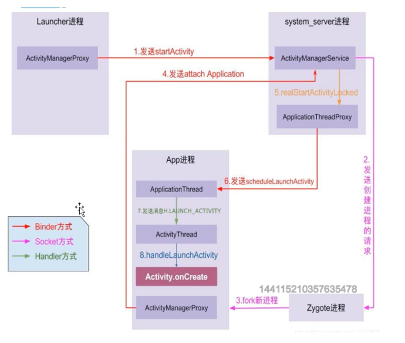
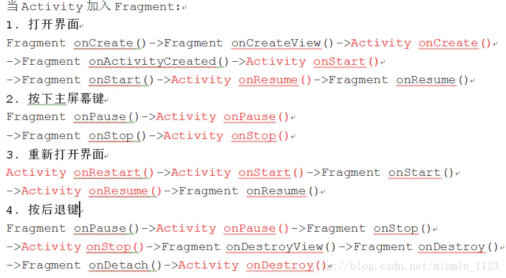
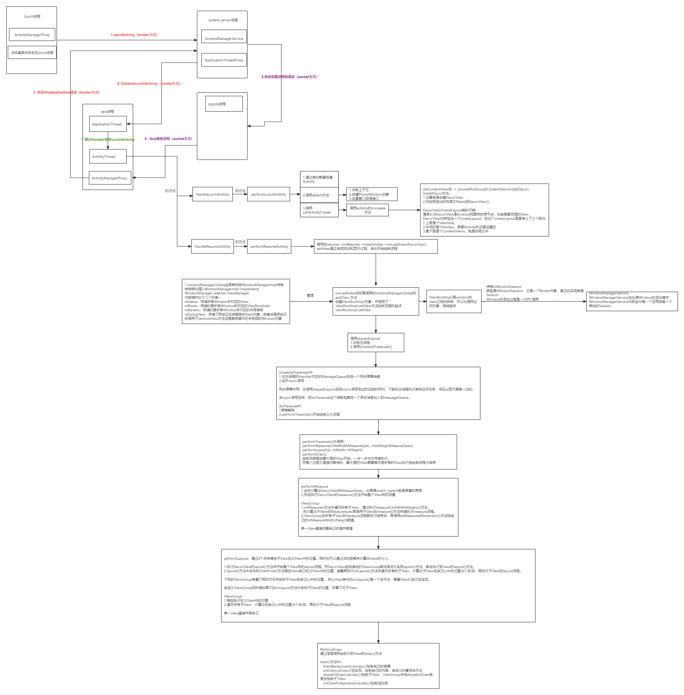
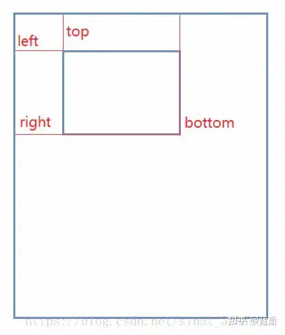
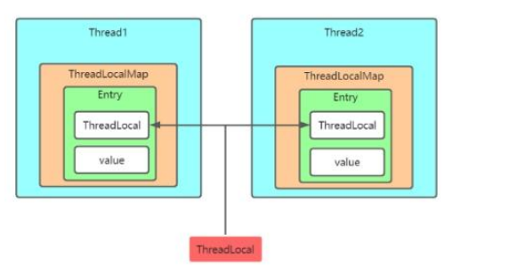
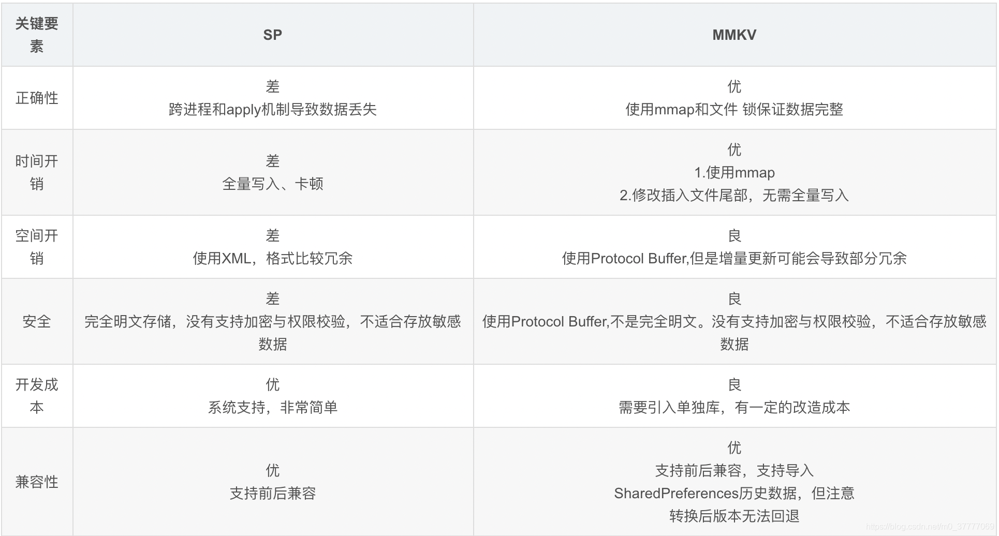
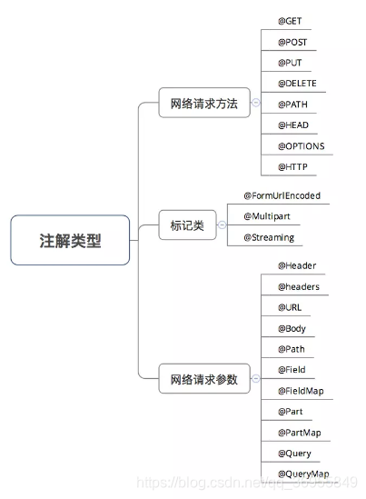
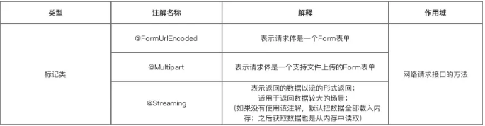

# Activity

## 1.Activity生命周期

onCreate（）：是 activity 的创建时候调用，做一些初始化布局之类的操作                        
onStart（）：即将显示页面的时候调用。用户无法操作，也是初始化操作，                               
onresume（）：当前 Activity 处于栈顶，获取焦点可以和用户进行交互，处于运行状态                
onPause（）：暂停状态。可能被其他的 activity
覆盖，仍然可见，但是失去焦点不能和用户进行交互                         
onstop（）：完全不可见的时候被调用。处于停止状态。内存不足这个 Activity
可能会被杀死，进行资源回收。                
ondestroy（）：activity 被销毁的时候调用，进行资源释放。                 
onRestart（）：从不可见的时候变成可见。            
成对出现：onCreate 和 onDestroy：根据 activity 创建和销毁               
onStart 和 onstop：根据 activity 是否可见，            
onResume 和 onpause：根据 activity 是否显示在前台

### (1)从A->B->A

    A 到 B 
    A(oncreate() -> onStart()->onResume()) ——> A(onpause()) ——> B（oncreate() -> onStart()->
    onResume()）——> A(onstop())

    返回 B
    B (onpause()) ——> A(onRestart() -> onStart()->onResume()) ——> B(onstop()->onDestroy())
    总结：页面可见性发生改变时候，当前页面先调用 onpause();

### (2)横竖屏切换时activity的生命周期

#### AndroidManifest没有设置configChange属性的时候

    启动：
    oncreate -> onstart -> onResume
    切换横竖屏->onPause -> onSaveInstaceState ->onstop->onDestrory 
    重新启动可见->oncreate -> onstart -> onReStoreInstanceState-> onResume   

总结:
没有设置configChanges属性，Android6.0，7.0，8.0系统手机表现都是一样的，当前的界面调用onSavelnstanceState走一遍流程，然后重启调用onRestorelnstanceState再走一遍完整流程，最终destory.

#### AndroidManifest设置了configChanges,android:configChanges="orientation”竖屏，

Android 6.0

    启动:
    onCreate --> onStart --> onResume
    切换横屏:
    onPause -->onSavelnstanceState -->onStop -->onDestroy 
    -->onCreate-->onStart-->onRestorelnstanceState-->onResume 

Android 7.0

    onConfigurationChanged-->onPause -->onSavelnstanceState -->onStop -->onDestroy 
    -->onCreate-->onStart -->onRestorelnstanceState-->onResume 

Android 8.0

    onConfigurationChanged

总结: 设置了configChanges属性为orientation之后Android6.0
同没有设置configChanges情况相同，完整的走完了两个生命周期，调用了onSavelnstanceState和onRestorelnstanceState方法;      
Android 7.0则会先回调onConfigurationChanged方法，剩下的流程跟Android6.0
保持一致;                      
Android 8.0 系统更是简单只是回调了onConfigurationChanged方法，并没有走Activity的生命周期方法。

## 2.Activity 的四个启动模式

FLAG_ACTIVITY_SINGLE_TOP:对应 singleTop
启动模式。                                                             
FLAG_ACTIVITY_NEW_TASK:对应 singleTask 模式。

### 标准模式

就是不管 activity 存不存在都 new 一个 Activity 出来放在当前任务栈的栈顶，
比如 ABCD 四个 Activity，D 处于栈顶，D 要通过 Intent 跳转到 A,则任务栈中就是 ABCDA。
比较常见的场景是：社交应用中，点击查看用户 A 信息->查看用户 A 粉丝->在粉丝中挑选查看用户 B 信息->查看用户
A 粉丝... 这种情况下一般我们需要保留用户操作 Activity 栈的页面所有执行顺序。

### Singletop

如果要启动的 Activity 处于栈顶，则调用 onNewIntent（）                             
比如 ABCD 四个 Activity，D 处于栈顶，D 要通过 Intent 要跳转到它本身的 D ,调用 onNewIntent（）
比如 ABCD 四个 Activity，D 处于栈顶，D 要通过 Intent 要跳转到 B，新建一个 B 压入栈顶，任务栈中就是 ABCDB

举例：三条推送点进去是一个 Activity，SingTop App
用户收到几条好友请求的推送消息，需要用户点击推送通知进入到请求者个人信息页，将信息页设置为SingleTop
模式就可以增强复用性。

### SingTask

根据 TaskAffinity 寻找对应的任务栈。                                                   
如果任务栈不存在，那就新建任务栈，新建 activity
实例。                                                                           
如果任务栈存在：任务栈中不存在该 Activity 实例，就新建一个 Activity
压入栈                                                                        
任务栈中存在该实例，将该实例顶部的实例出栈，并将自己置于栈顶

比如 ABCD，要从 D 通过 Intent 跳转到 B（走 onNewIntent），则弹出 CD 销毁，变成 AB

举例，首页肯定在栈底。                 
使用举例：浏览器首页，用户从多个应用启动浏览器首页，主页面仅仅启动一次，其余都走onNewIntent,并且清空主页面上的其他页面。

onNewIntent 的调用时机：singleTop、singleTask、singleInstance 模式下都会调用 onNewIntent()。
目的：复用Activity;
onCreate() 和 onNewIntent() 不会被同时调用。

调用 onNewIntent()生命周期如下：onNewIntent()->onRestart()->onStart()->onResume()。

onNewIntent 方法， 如下所示:

    protected void onNewIntent(Intent intent) {
        super.onNewIntent(intent); 
        setIntent(intent); 
    }

注意：没有在 onNewIntent()里面设置 setIntent()方法，将最新的 intent 设置给这个 activity 实例。那么在
onNewIntent()里面的 getIntent()得到的 intent 都是旧数据。

onNewIntent(Intent intent)方法就是提供给 singleTask 模式这种特定实现的有效保持 intent 上下文的方法；

### 单例模式

一个实例单独占一个任务栈，全局唯一性，如果使用时已经存在就将该任务栈调度到前台。

任务栈是 APP 管理 Activity 的一种容器 ，一般一个应用程序一个任务栈，任务栈管理该应用的 activity 进出栈

taskAffinity 属性能给 Activity 指定 task,但必须使用 FLAG_ACTIVITY_NEW_TASK 标记
默认的 taskAffinity 常用于独立栈：

用例：比如闹钟的提醒页面，点击之后进入闹钟详情，再返回原app不影响原来的app

## 3.Activity/Dialog/PopupWindow/Toast与WindowState:

    * Activity/Dialog/PopupWindow/Toast在WMS都有对应的WindowState，
    * 只是Activity/Dialog/PopupWindow的WindowState属于同一个AppWindowToken，也就是Activity的token,
    * 而Toast的WindowState属于自己独有的WindowToken。

## 4. Android 程序中 Context 分成两种。

一种是 Activity Context，另一种是 Application Context。

凡是跟 UI 相关的，都应该使⽤Activity 做为 Context 来处理

通过 Application Context 来启动 Activity 的话。就需要 FLAG_ACTIVITY_NEW_TASK 属性，不管这个 Activity
是属于其他程序还是自己这个程序的。

使用：

    Intent intent = new Intent(new Intent(this, TestActivity.class));
    intent.setFlags(Intent.FLAG_ACTIVITY_NEW_TASK); MyApplication.getContext().startActivity(intent);

如果我们用ApplicationContext 去启动一个 LaunchMode 为 standard 的 Activity 的时候会报错

    android.util.AndroidRuntimeException: Calling startActivity from outside of an Activity
    context requires the FLAG_ACTIVITY_NEW_TASK flag. Is this really what you want?

因为 ⾮Activity 类型的 Context 并没有所谓的任务栈，所以待启动的 Activity 就找不到栈了。
为待启动的 Activity 指定 FLAG_ACTIVITY_NEW_TASK 标记位，这样启动的时候就为它创建一个新的任务栈，而此时
Activity 是以 singleTask 模式启动的。

在 Application 和 Service 中去 layout inflate 也是合法的，但是会使用系统默认的主题样式，如果你自定义了某些样式可能不会被使用。所以这种方式也不推荐使用。

对于 startActivity 操作                                    
①当为 Activity Context 则可直接使用                                                             
②当为其他 Context, 则必须带上 FLAG_ACTIVITY_NEW_TASK flags 才能使用，因为⾮ Activity context 启动
Activity 没有 Activity 栈，则无法启动，因此需要加开启新的栈;

另外 UI 相关要 Activity 中使用

getApplication和getApplicationContext区别?

1.对于Activity/Service来说,getApplication(和getApplicationContext0的返回值完全相同;
除非厂商修改过接口;                                  
2.BroadcastReceiver在onReceive的过程，能使用getBaseContext.getApplicationContext获取所在Application,而无法使用getApplication;                            
3.ContentProvider能使用getContext0.getApplicationContext获取所在应用程序。绝大多数情况下没有问题，但是有可能会出现空指针的问题，                    
情况如下:                        
当同一个进程有多个apk的情况下，对于第二个apk是由provider方式拉起的，前面介绍过provider创建过程并不会初始化所在应用程序，此时执行返回的结果便是空。所以对于这种情况要做好判空。

## 5.activit相关问题

### (1)onDestory()一定会执行吗？

正常情况下的返回 onDestory 一定会执行的，
后台强杀可能会发生：

当前仅有一个 Activity,这时候强杀，会执行，                                
当前很多 activity 实例，从 A 到 B 到 C，后台强杀只会 A 的 onDestroy，BC 都不会执行了。

### (2)onStop()一定会执行吗？

如果要启动的是个透明的窗口,或者是对话框的样式,就不会执行。onstop 用于停止更新 UI。

### (3)怎么写一个Activity 的统一管理类：

⑴定义一个 ActivityManager 实现
Application.ActivityLifecycleCallbacks；                                        
⑵List<WeakReference<Activity>> mActivityStack；

七个方法

    1,onActivityCreated(@NonNull Activity activity, @Nullable Bundle savedInstanceState) { 
        Addactivity()
    }
    
    2,onActivityStarted(@NonNull Activity acvity) 

    3,onActivityResumed(@NonNull Activity activity){ 
        mCurrentResumedActivity = activity
    }

    4,onActivityPaused(@NonNull Activity activity){ 
        mCurrentResumedActivity = null 
    }

    5,onActivityStopped(@NonNull Activity activity) 

    6,onActivitySaveInstanceState(@NonNull Activity activity, @NonNull Bundle outState) 

    7,onActivityDestroyed(@NonNull Activity activity){ 
        removeActivity
    }

## 6.Intent 可传递的数据类型有 3 种

1.java 的 8 种基本数据类型（boolean byte char short int long float double）、String
以及他们的数组形式；                            
2.Bundle 类，Bundle 是一个以键值对的形式存储可传输数据的容器；                                
3.实现了 Serializable 和 Parcelable 接口的对象，这些对象实现了序列化。

    Intent 传输数据的大小有限制吗？如何解决？

    答：Intent 中的 Bundle 是使用 Binder 机制进行数据传送的，数据会写到内核空间，
    Binder 的缓冲区是有大小限制的,有些 ROM 是 1M, 有些 ROM 是 2M;

    解决办法：
    1.尽量减少传输数据量。
    2.Intent 通过绑定一个 Bundle 来传输，这个可以超过 1M，不过也不能过大。
    3.通过内存共享，使用静态变量或者使用 EventBus 等类似的通信工具。
    4.通过文件共享。

## 7.Activity加载的流程

App 启动流程(基于Android8.0)

点击桌面 App图标，Launcher进程采用 BinderIPC(具体为ActivityManager.getService 获取 AMS 实例)system
server的AMS发起 startActivity请求                    
system _server 进程收到请求后，向 Zygote 进程发送创建进程的请求Zygote 进程 fork 出新的子进程，即 App
进程，

App 进程创建即初始化 ActivityThread，然后通过 BinderIPC 向 system server 进程的 AMS 发起
attachApplication 请求，system server 进程的 AMS 在收到 attachApplication 请求后，做一系列操作后，通知
ApplicationThread去bindApplication，然后发送 H.BIND APPLICATION 消息

主线程收到 H.BIND APPLICATION 消息，调用handleBindApplication 处理后做一系列的初始化操作初始化
Application 等

system server 进程的 AMS 在 bindApplication
后，会调用ActivityStackSupervisor.attachApplicationLocked，之后经过一系列操作，在
realStartActivityLocked 方法通过Binder IPC 向 App 进程发送scheduleLaunchActivity 请求。

app的binder 线程 (ApplicationThread) 在收到请求后，通过 handler 向主线程发送LAUNCH ACTIVITY 消息;

主线程收到 message后经过 handleLaunchActivity，performLaunchActivity
方法，然后通过反射机制创建目标Activity ;

通过Activityattach方法创建 window并目和 Activity 关联，然后设置 WindowManager 用来管理 window，然后通知
Activity 已创建，即调用 onCreate

然后调用 handleResumeActivity，Activity可见

# 广播

## BroadcastReceiver 与LocalBroadcastReceiver 有什么区别?

BroadcastReceiver
是跨应用广播，利用Binder机制实现支持动态和静态两种方式注册方式。                                         
LocalBroadcastReceiver 是应用内广播，利用Handler
实现，利用了IntentFilter的match功能，提供消息的发布与接收功能，实现应用内通信，效率和安全性比较 高仅支持动态注册

# Services

## 1.IntentService

IntentService是Service的子类，继承与Service类，用于处理需要异步请求。

用户通过调用 Context.StartService(Intent)
发送请求，服务根据需要启动，使用工作线程依次处理每个Intent，并在处理完所有工作后自身停止服务。            
使用时，扩展IntentService并实现onHandleIntent(android.content.Intent)
,IntentService接收Intent，启动工作线程，并在适当时机停止服务。                  
所有的请求都在同一个工作线程上处理，一次处理一个请求，所以处理完所以的请求可能会花费很长的时间，但由于IntentService是另外了线程来工作，所以保证不会阻止App的主线程。

## 2.IntentService与Service的区别

### 何时使用

Service用于没有UI工作的任务，但不能执行长任务(长时间的任务)
，如果需要Service来执行长时间的任务，则必须手动开启个线程来执行该Service。                                                   
IntentService可用于执行不与主线程沟通的长任务.

### 触发方法

Service通过调用 startService() 方法来触发。                                         
IntentService通过Intent来触发，开启一个新的工作线 程并在线程上调用onHandleIntent方法

### 运行环境

Service
在App主线程上运行，没有与用户交互，即在后台运行，如果执行长时间的请求任务会阻止主线程工作。                                     
IntentService在自己单独开启的工作线程上运行，即使执行长时间的请求任务也不会阻止主线程工作。

### 何时停止

如果执行了Service，我们是有责任在其请求任务完成后关闭服务，通过调用 stopSelf 或 stopService
来结束服务.                                    
IntentService会在执行完所有的请求任务后自行关闭服务，所以我们不必额外调用stopSelf去关闭它.

## 3. 谈一谈startService和bindService的区别，生命周期以及使用场景?

### 1、生命周期上的区别

执行startService时，Service会经历onCreate->
onStartCommand。当执行stopService时，直接调用onDestroy方法。调用者如果没有stopService，Service
会一直在后台运行，下次调用者再起来仍然可以stopService。

执行bindService时，Service会经历onCreate->
onBind。这个时候调用者和Service绑定在一起。调用者调用unbindService方法或者调用者Context不存在了 (
如Activity被finish了)，Service就会调用onUnbind->onDestroy。这里所谓的绑定在一起就是说两者共存亡了。

多次调用startService,该Service只能被创建一次，即该Service的onCreate方法只会被调用一次。                                           
但是每次调用startService，onStartCommand方法都会被调用。Service的onStart方法在API5时被废弃，替代它的是onStartCommand方法。

第一次执行bindService时，onCreate和onBind方法会被调用，但是多次执行bindService方法，onCreate和onBind方法并不会被多次调用，即并不会多次创建服务和绑定服务。

### 2、调用者如何获取绑定后的Service的方法

onBind回调方法将返回给客户端一个IBinder接口实例，IBinder允许客户端回调服务的方法，比如得到Service运行的状态或其他操作。
我们需要IBinder对象返回具体的Service对象才能操作，所以说具体的Service对象必须首先实现Binder对象

### 3、既使用startService又使用bindService的情况

如果一个Service又被启动又被绑定，则该Service会一直在后台运行。首先不管如何调用，onCreate始终只会调用一次。对应startService调用多少次，Service的onStart
方法便会调用多少次。

Service的终止，需要unbindService和stopService同时调用才行。不管startService与bindService的调用顺序。                              
如果先调用unbindService，此时服务不会自动终止，再调用stopService之后，服务才会终止;

如果先调用stopService，此时服务也不会终止，而再调用unbindService或者之前调用bindService的Context不存在了(
如Activity被finish的时候)之后，服务才会自动停止。

那么，什么情况下既使用startService，又使用bindService呢?                               
如果你只是想要启动一个后台服务长期进行某项任务，那么使用startService便可以了。如果你还想要与正在运行的Service取得联系，那么有两种方法:
一种是使用broadcast，另一种是使用bindService。                                      
前者的缺点是如果交流较为频繁，容易造成性能上的问题，而后者则没有这些问题。因此，这种情况就需要startService和bindService一起使用了。

## 4.本地服务与远程服务

本地服务依附在主进程上，在一定程度上节约了资源。本地服务因为是在同一进程，因此不需要IPC，也不需要AIDL。相应bindservice会方便很多。
缺点是主进程被kill后，服务便会终止。

远程服务是独立的进程，对应进程名格式为所在包名加上你指定的android:
process字符串。由于是独立的进程，因此在Activity所在进程被kill的是偶，该服务依然在运行。
缺点是该服务是独立的进程，会占用一定资源，并且使用AIDL进行IPC稍微麻烦一点。

对于startservice来说，不管是本地服务还是远程服务，我们需要做的工作都一样简单。

## 5.Service如何进行保活?

利用系统广播拉活                               
利用系统service拉活                               
利用Native进程拉活<Android5.0以后失效> fork进行监控主进程，利用native拉活                           
利用JobScheduler机制拉活<Android5.0以后>利用账号同步机制拉活

# ContentProvider是如何实现数据共享的?

ContentProvider (内容提供者):对外提供了统一的访问数据的接口。
ContentResolver (内容解析者): 通过URI的不同来操作不同的ContentProvider中的数据
ContentObserver (内容观察者): 观察特定URI引起的数据库的变化。
通过ContentResolver进行注册，观察数据是否发生变化及时通知刷新页面(通过Handler通知主线程更 新UI)

ContentProvider
：内容提供者，对外提供了统一的访问数据的接口,用于对外提供数据,比如联系人应用中就是用了ContentProvider           
一个应用可以实现ContentProvider来提供给别的应用操作通过ContentResolver来操作别的应用数据

ContentResolver
：内容解析者，用于获取内容提供者提供的数据,通过URI的不同来操作不同的ContentProvider中的数据              
ContentResolver.NotifyChanged(uri)发出消息

ContentObserver ：内容监听者,可以监听数据的改变状态 观察(捕捉)
特定的Uri引起的数据库的变化,及时通知刷新页面(通过Handler通知主线程更 新UI)               
ContentResolver.registerContentObserver监听消息

概括:                              
使用ContentResolver来获取ContentProvider提供的数据，同时注册ContentObserver监听数据的变化

# Fragment

## Fragment从创建到销毁整个生命周期中涉及到的方法依次为：

onAttach()→onCreate()→onCreateView()→onActivityCreated()→onStart()→onResume()                   
→onPause()→onStop()→onDestroyView()→onDestroy()→onDetach()，

打开界面                       
onCreate ()->onCreateView()->onActivityCreated()->onStart()->onResume()                   
按下主屏幕键                       
onPause() ->onStop ()                
重新打开界面                    
onStart()->onResume ()                    
按后退键                 
onPause ()->onStop()->onDestroyView()->onDestroy()->onDetach()

和Activity有不同的方法：                                                                                
onAttach()：当Fragment和Activity建立关联时调用；            
onCreateView()：当fragment创建视图调用，在onCreate之后；          
onActivityCreated()：当与Fragment相关联的Activity完成onCreate()之后调用；           
onDestroyView()：在Fragment中的布局被移除时调用；                          
onDetach()：当Fragment和Activity解除关联时调用；

onViewCreated在onActivityCreated之前

## Fragment中add、remove、replace区别

首先获取FragmentTransaction对象：

    FragmentTransaction transaction = getFragmentManager().beginTransaction();

两种方法不同之处：是否要清空容器再添加fragment的区别，用法上add配合hide或是remove使用，replace一般单独出现。

添加add: 一般会配合hide使用

    transaction.add(R.id.fragment_container, oneFragment).hide(twoFragment).commit()

第一个参数是容器id， 第二个参数是要添加的fragment，添加不会清空容器中的内容，不停的往里面添加。

不允许添加同一个fragment实例，这是非常重要的特点。
如果一个fragment已经进来的话，再次添加的话会报异常错误的
，添加进来的fragment都是可见的（visible），后添加的fragment会展示在先添加的fragment上面，在绘制界面的时候会绘制所有可见的view                      
所以大多数add都是和hide或者是remove同时使用的。这样可以节省绘制界面的时间，节省内存消耗，是推荐的用法。

替换replace:

    transaction.replace(R.id.fragment_container, oneFragment).commit()

替换会把容器中的所有内容全都替换掉，有一些app会使用这样的做法，保持只有一个fragment在显示，减少了界面的层级关系。

相同之处：每次add和replace都要走一遍fragment 的周期。

处理方式：
首先在add的时候，加上一个tab参数

    transaction.add(R.id.content, ContentFragment,“tag”);

然后当ContentFragment引用被回收置空的话，先通过

    ContentFragment＝FragmentManager.findFragmentByTag("tag"); 

找到对应的引用，然后继续上面的hide,show来处理;

## FragmentPagerAdapter与FragmentStatePagerAdapter的区别与使用场景

相同点:二者都继承PagerAdapter                      
不同点:FragmentPagerAdapter的每个Fragment会持久的保存在FragmentManager中，只要用户可以返回到页面中，它都不会被销毁。
因此适用于那些数据相对静态的页，Fragment数量也比较少的那种；                          
FragmentStatePagerAdapter只保留当前页面，当页面不可见时，该Fragment就会被消除，释放其资源。因此适用于那些数据动态性较大、占用内存较多，多Fragment的情况；

## Fragment懒加载
Fragment懒加载，则是在Fragment可见时，立即触发生命周期方法和数据加载操作。
- 重写setUserVisibleHint()
ViewPager+Fragment的预加载机制,切换fragment的时候，会重新创建当前界面及左右界面三个界面，每次切换都要重新onCreate, 只要设置viewPager.setOffscreenPageLimit即可避免这个问题。            
- 默认不设置数量的情况下预加载下一页。设置0和1是同样的效果。
- 如果ViewPager设置了setOffscreenPageLimit(2)，表示除了当前页面外，还会预加载当前页面的前后两个页面。假设有三个Fragment，分别是A、B、C。初始状态下，ViewPager会预加载A和B两个页面。当用户滑动到B页面时，ViewPager会预加载C页面，当用户滑动到C页面时，ViewPager不再进行预加载。
- viewPager.setOffscreenPageLimit(3);表示三个界面之间来回切换都不会重新加载

在预加载机制上 实现懒加载

老一套的懒加载                 
优点：不用去控制 FragmentManager的 add+show+hide 方法，所有的懒加载都是在Fragment 内部控制，也就是控制 setUserVisibleHint + onHiddenChanged 这两个函数。                 
缺点：实际不可见的 Fragment，其 onResume 方法任然会被调用，这种反常规的逻辑，无法容忍。                 

新一套的懒加载（Androidx下setMaxLifecycle）            
优点：在非特殊的情况下(缺点1)，只有实际的可见 Fragment，其 onResume 方法才会被调用，这样才符合方法设计的初衷。            
缺点：对于 Fragment 的嵌套，及时使用了setMaxLifecycle方法。同级不可见的Fragment， 仍然要调用onResume方法。需要在原有的 add+show+hide 方法中，继续调用setMaxLifecycle方法来控制Fragment的最大生命状态。

## ViewPager    

ViewPager2和viewPager        

ViewPager2默认是懒加载的，ViewPager默认是预加载的(左右各1个)       
为什么ViewPager设置宽度、高度无效？            
在OnMeasure()中，先立刻执行了setMeasuredDimension(getDefaultSize(0, widthMeasureSpec),getDefaultSize(0, heightMeasureSpec)); 并没有测量完所有的孩子后根据孩子的大小设置自己的。可见，ViewPager的宽高是由它的容器决定的。           
官方注释这么做的原因：我们依靠容器来指定视图的布局大小。我们无法真正知道它是什么，因为我们将添加和删除不同的任意视图并且不希望布局在这种情况下发生变化。            

# View整体机制

## 绘制流程起点

Activity对View的管理委托给Window，外界访问Window是通过WindowManager，windowManager实现了viewManager接口（具有addView,updateView,removeView能力）        
因此WindowManager具有对view的管理能力，WindowManagerImpl继承了WindowManager，但是并没有实现WindowManager的三大操作,而是将所有的操作全部委托给WindowManagerGlobal来实现。           
WindowManagerGlobal以工厂的形式向外提供自己的实例，存储Window对应的所有View：Window对应的所有ViewRootImpl,Window对应的所有的布局参数,存储正在被删除的View对象，或者说是那些已经调用removeView方法但是删除操作还未完成的Window对象

    // 存储Window对应的所有View：
    private final ArrayList<View> mViews = new ArrayList<View>();
    // 存储Window对应的所有ViewRootImpl：
    private final ArrayList<ViewRootImpl> mRoots = new ArrayList<ViewRootImpl>();
    // 存储Window对应的所有的布局参数：
    private final ArrayList<WindowManager.LayoutParams> mParams =
    new ArrayList<WindowManager.LayoutParams>();
    // 存储正在被删除的View对象，或者说是那些已经调用removeView方法但是删除操作还未完成的Window对象：
    private final ArraySet<View> mDyingViews = new ArraySet<View>();

WindowManagerGlobal的addView方法中通过ViewRootImpl的setView方法来更新界面并完成Window的添加过程：
在ViewRootImpl的setView方法中又会调用requestLayout方法来完成异步刷新请求。

调用requestLayout后，先加同步屏障，然后监听vsync信号，等着vsync信号到达后，把doTraversal这个函数包裹成一个异步消息加入到messageQueue 

doTraversal这个函数被封装成了一个runnable异步消息,屏障解除和3大流程开始，都是这个异步消息的执行体中做的事情
所以这个同步屏障的作用就是，在调用requestLayout后到vsync信号到达的这段时间内，不能在主线程执行其他任何任务，保证ui显示是第一位的

    @Override
    public void requestLayout() {
        if (!mHandlingLayoutInLayoutRequest) {
            //校验主线程
            checkThread();
            mLayoutRequested = true;
            //调用这个方法启动绘制流程
            scheduleTraversals();
        }
    }

    //在调用scheduleTraversals()的时候 postSyncBarrier添加同步消息屏障
    @UnsupportedAppUsage
    void scheduleTraversals() {
        if (!mTraversalScheduled) {
            mTraversalScheduled = true;
            //1. 往主线程的Handler对应的MessageQueue发送一个同步屏障消息
            mTraversalBarrier = mHandler.getLooper().getQueue().postSyncBarrier();
            //2.将mTraversalRunnable保存到Choreographer中
            mChoreographer.postCallback(
                    Choreographer.CALLBACK_TRAVERSAL, mTraversalRunnable, null);
            if (!mUnbufferedInputDispatch) {
                scheduleConsumeBatchedInput();
            }
            notifyRendererOfFramePending();
            pokeDrawLockIfNeeded();
        } 
    
    //在doTraversal方法中移除同步消息屏障
    void doTraversal() {
        if (mTraversalScheduled) {
            mTraversalScheduled = false;
            //移除同步屏障
            mHandler.getLooper().getQueue().removeSyncBarrier(mTraversalBarrier);
            ...
            //开始绘制
            performTraversals();
        }
    }

APP的ApplicationThread在收到scheduleLaunchActivity请求后，通过 handler 向主线程发送LAUNCH ACTIVITY
消息        
主线程收到 message后,执行handleLaunchActivity()->performLaunchActivity()->callActivityOnCreate()->Activity.onCreate()             
在performLaunchActivity方法中           
1.通过类加载器创建Activity的实例对象          
2.调用attach方法来关联运行过程中所依赖的一系列上下文环境变量           

在attach方法中:    
初始化上下文           
创建Activity所属的Window对象(phoneWindow)       
并为window对象其设置回调接口        

decorView显示过程：  
Activity的setContentView中 调用 PhoneWindow的setContentView方法 完成了DecorView的创建和初始化， 
Activity的布局文件也成功添加到DecorView中 

ActivityThread的handleResumeActivity方法会调用Activity的onResume方法
onResume方法中会调用Activity的makeVisible方法让DecorView真正完成添加和显示过程
makeVisible方法中WindowManager的addView()方法将Activity的根View(DecorView)添加上去，进而开始绘制流程       

handleResumeActivity()方法，在方法中先调用Activity.onResume()方法，再执行WindowManager的addView()
方法将Activity的根View(DecorView)添加上去，进而开始绘制流程。      

## 绘制过程

绘制流程是由最外层的View开始，一步一步向内传递执行。而整个过程又是递归等待的，最外层的View需要等内层所有的View执行完绘制流程才结束
从performTraversals开始

    private void performTraversals() {

        //计算DecorView根View的MeasureSpec
        int childWidthMeasureSpec = getRootMeasureSpec(mWidth, lp.width);
        int childHeightMeasureSpec = getRootMeasureSpec(mHeight, lp.height);
    
        performMeasure(childWidthMeasureSpec, childHeightMeasureSpec);
    
        performLayout(lp, mWidth, mHeight);
    
        performDraw();
    }

### Measure

measure流程开始执行之前，会先计算出DecorView的MeasureSpec。如果是match_parent就是屏幕的宽高

    //生成DecorView根View的MeasureSpec
    int childWidthMeasureSpec = getRootMeasureSpec(mWidth, lp.width);
    int childHeightMeasureSpec = getRootMeasureSpec(mHeight, lp.height);

然后执行DecorView的measure()方法开始整个View树的测量。measure()
方法是被final修饰了的，派生类都不能重写，所有View都会执行到View类的measure()方法。

    public final void measure(int widthMeasureSpec, int heightMeasureSpec) {
        onMeasure(widthMeasureSpec, heightMeasureSpec);
    }

onMeasure()方法意在二种:
相对于ViewGroup来说
1.onMeasure()方法中遍历所有子View，通过执行measureChildWithMargins()
方法，先计算出子View的MeasureSpec再调用子View的measure()方法传递执行measure流程。
2.ViewGroup在所有子View的measure流程都执行结束后，再调用setMeasuredDimension()
方法给自己的mMeasureWidth/Height赋值。

单一View直接

    protected void onMeasure(int widthMeasureSpec, int heightMeasureSpec) {
            setMeasuredDimension(getDefaultSize(getSuggestedMinimumWidth(), widthMeasureSpec),getDefaultSize(getSuggestedMinimumHeight(), heightMeasureSpec));
    }

MeasureSpec

父View在帮助计算子View的MeasureSpec时有着固定的套路:
受父View的MeasureSpec影响
受子View自身的LayoutParams影响
计算父View剩下可用的区域，减去父View的padding和子View的margin距离和父View已经使用(预定)的区域大小。

### Layout

Layout流程通过4个点来确定子View在父View中的位置。同时也可以通过点的距离来计算出View的大小。

    public final int getWidth() {
        return mRight - mLeft;
    }
    
    public final int getHeight() {
        return mBottom - mTop;
    }              

performLayout方法中会执行DecorView的layout()
方法来开始整个View树的layout流程。而DecorView包括其他的ViewGroup都没有另外实现layout()
方法，都会执行到View的layout()方法。                  
layout()方法中会先执行setFrme()方法确定View自己在父View中的位置，接着再执行onLayout()
方法来遍历所有的子View，计算出子View在自己心中的位置(4个点)后，再执行子View的layout流程。              
不同的ViewGroup有着不同的方式来安排子View在自己心中的位置。 所以View类中的onLayout()
是一个空方法，等着View们自己去实现。
自定义ViewGroup的时候如果不在onLayout方法中安排子View的位置，将看不见子View。

laout流程，相对于ViewGroup而言:           
1.确定自己在父View中的位置             
2.遍历所有子View，计算出在自己心中的位置(4个点)后，再执行子View的layout流程         

相对于View(单个View)而言只干第一件事。        

### draw

performDraw()方法中通过层层调用会执行到View的draw()方法。

    private void performDraw() {
        draw(fullRedrawNeeded);
    }
    private void draw(boolean fullRedrawNeeded) {
        if (!drawSoftware(surface, mAttachInfo, xOffset, yOffset, scalingRequired, dirty)) {
        return;
        }
    }
    private boolean drawSoftware(Surface surface, AttachInfo attachInfo, int xoff, int yoff,boolean scalingRequired, Rect dirty) {
        mView.draw(canvas);
    }
    public void draw(Canvas canvas) {
        //绘制自己的背景
        drawBackground(canvas);
        //空实现，绘制自己的内容，自定义时重写该方法
        onDraw(canvas)
        //绘制子View
        dispatchDraw(canvas);
        //绘制前景
        onDrawForeground(canvas);
    }

## 事件分发过程

当屏幕被触摸，首先会通过硬件产生触摸事件传入内核，然后走到viewRootImpl的setView
方法，在requestLayout时机之后,监听inputManager
当事件到来就 调用到processPointerEvent方法，在其中调用了mView(decorView).dispatchPointerEvent(event)
;就传递给decorView
再传给ViewGroup的dispatchTouchEvent，在这个方法中
一个完整的事件序列是以 DOWN 开始，以 UP 结束的。所以，如果是 DOWN 事件，说明这是一个新的事件序列，故而需要初始化之前的状态。
当前 ViewGroup 是否拦截了此事件，如果拦截了，mFirstTouchTarget == null，如果没有拦截则交给子 View
来处理，mFirstTouchTarget != null。
进行mFirstTouchTarget的传递，
FLAG_DISALLOW_INTERCEPT 标志位，它主要是禁止 ViewGroup 拦截除了 DOWN 之外的事件，一般通过子
View.requestDisallowInterceptTouchEvent(...) 来设置。

    ViewRootImpl.setView (){
        synchronized (this) {
            if (mView == null) {
                mAttachInfo.mDisplayState = mDisplay.getState();
                ......
                requestLayout();
                ....... 
                //事件传递
                InputStage earlyPostImeStage = new EarlyPostImeInputStage(nativePostImeStage);
            }
        }
    }
        
      final class ViewPostImeInputStage extends InputStage {
        public ViewPostImeInputStage(InputStage next) {
            super(next);
        }

        @Override
        protected int onProcess(QueuedInputEvent q) {
            if (q.mEvent instanceof KeyEvent) {
                return processKeyEvent(q);
            } else {
                final int source = q.mEvent.getSource();
                if ((source & InputDevice.SOURCE_CLASS_POINTER) != 0) {
                    //关键方法
                    return processPointerEvent(q);
                } else if ((source & InputDevice.SOURCE_CLASS_TRACKBALL) != 0) {
                    return processTrackballEvent(q);
                } else {
                    return processGenericMotionEvent(q);
                }
            }
        }

        private int processPointerEvent(QueuedInputEvent q) {
            final MotionEvent event = (MotionEvent)q.mEvent;
            mHandwritingInitiator.onTouchEvent(event);

            mAttachInfo.mUnbufferedDispatchRequested = false;
            mAttachInfo.mHandlingPointerEvent = true;
            //关键方法，mView就是decorView
            boolean handled = mView.dispatchPointerEvent(event);
            maybeUpdatePointerIcon(event);
            maybeUpdateTooltip(event);
            mAttachInfo.mHandlingPointerEvent = false;
            if (mAttachInfo.mUnbufferedDispatchRequested && !mUnbufferedInputDispatch) {
                mUnbufferedInputDispatch = true;
                if (mConsumeBatchedInputScheduled) {
                    scheduleConsumeBatchedInputImmediately();
                }
            }
            return handled ? FINISH_HANDLED : FORWARD;
        }
    }

        
    @UnsupportedAppUsage
    public final boolean dispatchPointerEvent(MotionEvent event) {
        if (event.isTouchEvent()) {
            //关键代码
            return dispatchTouchEvent(event); 
        } else {
        return dispatchGenericMotionEvent(event);
        }
    }
    
    // /frameworks/base/core/java/android/view/ViewGroup.java
    @Override
    public boolean dispatchTouchEvent(MotionEvent ev) {
    ...
         if (onFilterTouchEventForSecurity(ev)) {
             ...
             // Handle an initial down.
            //首先会判断事件是否是为 ACTION_DOWN 事件，如果是，则进行初始化
            //因为一个完整的事件序列是以 DOWN 开始，以 UP 结束的。所以，如果是 DOWN 事件，说明这是一个新的事件序列，故而需要初始化之前的状态

             if (actionMasked == MotionEvent.ACTION_DOWN) {
                 cancelAndClearTouchTargets(ev);
                 resetTouchState();
             }
    
             // Check for interception.
             final boolean intercepted;

            //mFirstTouchTarget 的意义是，当前 ViewGroup 是否拦截了此事件
            //如果拦截了，mFirstTouchTarget == null，如果没有拦截则交给子 View 来处理，mFirstTouchTarget != null。

             if (actionMasked == MotionEvent.ACTION_DOWN|| mFirstTouchTarget != null) { 
                 final boolean disallowIntercept = (mGroupFlags & FLAG_DISALLOW_INTERCEPT) != 0; // 2
                 if (!disallowIntercept) {
                     intercepted = onInterceptTouchEvent(ev);
                     ev.setAction(action); // restore action in case it was changed
                 } else {
                     intercepted = false;
                 }
             } else {
                 // There are no touch targets and this action is not an initial down
                 // so this view group continues to intercept touches.
                 intercepted = true;
             }
             ...
         }
         ...
         return handled;
    }

方法，而 ViewRootImpl.processPointerEvent(...) 方法中的mView就是DecorView。
InputStage earlyPostImeStage = new EarlyPostImeInputStage(nativePostImeStage);

## ConstraintLayout,LinearLayout,FrameLayout,RelativeLayout

1. ConstraintLayout:约束布局，通过设置视图之间的约束关系来确定它们的位置。
   它可以在水平和垂直方向上进行约束，以实现复杂的界面布局。适用于创建适应不同屏幕尺寸的响应式布局。

2. LinearLayout:线性布局，它将视图按照水平或垂直方向进行排列。 它可以通过设置权重来控制视图的大小比例。
   适用于简单的界面布局。 在嵌套使用多个LinearLayout时，可能会出现性能问题。
   绘制的时候只需要按照指定的方向绘制，绘制效率比Fragment要慢

3. FrameLayout:帧布局，它通过一个个层叠的视图来构建界面。
   它每次只显示一个视图，后面的视图会覆盖前面的视图。适用于单个视图或需要覆盖的情况，例如对话框、按钮点击效果等。
   布局比较简单，不支持复杂的界面布局。
   绘制速度最快，只需要将本身绘制出来即可，但是由于它的绘制方式导致在复杂场景中直接是不能使用的

4. RelativeLayout:相对布局，它通过相对于其他视图的位置来确定视图的位置。可以通过位置关系和边距来控制视图的相对位置。
   适合于视图之间有复杂相互关系的布局，例如标题栏、表单等。 当视图层级较多时，RelativeLayout的性能可能会受到影响。
   每个个子控件都是需要相对的其他控件来计算，按照View树的绘制流程、在不同的分支上要进行计算相对应的位置，绘制效率最低

综上所述：
ConstraintLayout是Android中功能最强大、灵活性最高的布局，适用于复杂的界面布局；
LinearLayout适合简单的线性布局；
FrameLayout适合覆盖或单个视图的布局；
RelativeLayout适合视图间有复杂相互关系的布局。选
择布局类型时需要根据具体的界面需求和性能要求来进行选择。

## Android动画

### 类型分类

1. 逐帧动画(Frame Animation)，即顺序播放事先准备的图片。

2. 补间动画(Tween Animation)，View的动画效果可以实现简单的平移、缩放、旋转。支持view动画，不支持非View动画

        // 旋转动画
        RotateAnimation animRotate = new RotateAnimation(0, 360,Animation.RELATIVE_TO_SELF, 0.5f, Animation.RELATIVE_TO_SELF, 0.5f);
        animRotate.setDuration(1000);// 动画时间
        animRotate.setFillAfter(true);// 保持动画结束状态
    
        // 缩放动画
        ScaleAnimation animScale = new ScaleAnimation(0, 1, 0, 1,Animation.RELATIVE_TO_SELF, 0.5f, Animation.RELATIVE_TO_SELF,0.5f);
        animScale.setDuration(1000);
        animScale.setFillAfter(true);// 保持动画结束状态

        // 渐变动画
        AlphaAnimation animAlpha = new AlphaAnimation(0, 1);
        animAlpha.setDuration(2000);// 动画时间
        animAlpha.setFillAfter(true);// 保持动画结束状态

        // 动画集合
        AnimationSet set = new AnimationSet(true);
        set.addAnimation(animRotate);
        set.addAnimation(animScale);
        set.addAnimation(animAlpha);
        
        // 启动动画
        rlRoot.startAnimation(set);

3. 属性动画(Property Animation)
   补间动画增强版，支持任意Java对象执行动画，不再局限于视图View对象,可自定义各种动画效果，不再局限于4种基本变换：平移、旋转、缩放 & 透明度。                     
   1.XML方式：

        <?xml version="1.0" encoding="utf-8"?> 
        <set xmlns:android="http://schemas.android.com/apk/res/android"> 
            <animator 
            android:valueFrom="0" 
            android:valueTo="100" 
            android:valueType="intType" 
            android:duration="3000" 
            android:startOffset ="1000" 
            android:fillBefore = "true" 
            android:fillAfter = "false" 
            android:fillEnabled= "true" 
            android:repeatMode= "restart" 
            android:repeatCount = "0" 
            android:interpolator="@android:anim/accelerate_interpolator"/> 
        </set>   

使用：

    Button b3 = (Button) findViewById(R.id.b3); 
    Animator mAnim = AnimatorInflater.loadAnimator(this, R.animator.animator_1_0);
    mAnim.setTarget(b3);
    mAnim.start();

  2.Java代码实现

    public static ObjectAnimator setObjectAnimator(View view , String type , int start , int end , long time){ 
        ObjectAnimator mAnimator = ObjectAnimator.ofFloat(view, type, start, end); 
     
        // 设置动画重复播放次数 = 重放次数+1 
        // 动画播放次数 = infinite时,动画无限重复 
        mAnimator.setRepeatCount(ValueAnimator.INFINITE); 
        // 设置动画运行的时长 
        mAnimator.setDuration(time); 
        // 设置动画延迟播放时间 
        mAnimator.setStartDelay(0); 
        // 设置重复播放动画模式 
        mAnimator.setRepeatMode(ValueAnimator.RESTART); 
        // ValueAnimator.RESTART(默认):正序重放 
        // ValueAnimator.REVERSE:倒序回放 
        //设置差值器 
        mAnimator.setInterpolator(new LinearInterpolator()); 
        return mAnimator; 
    }
ValueAnimator:先改变值，然后手动赋值 给对象的属性从而实现动画；是间接对对象属性进行操作；            
ObjectAnimator:先改变值，然后自动赋值 给对象的属性从而实现动画；是直接对对象属性进行操作；            

    //不同的定义方式
    ValueAnimator animator = null;

    if (isOpen) {
    //要关闭
        if (longHeight > shortHeight) {
            isOpen = false;
            animator = ValueAnimator.ofInt(longHeight, shortHeight);
        }
    } else {
        //要打开
        if (longHeight > shortHeight) {
            isOpen = true;
            animator = ValueAnimator.ofInt(shortHeight, longHeight);
        }
    }
        
    animator.start();

    //不同的定义方式
    ObjectAnimator animatorX = ObjectAnimator.ofFloat(mSplashImage, "scaleX", 1f, 2f);  
    animatorX.start();
组合：        
常用的组合方法            
• AnimatorSet.play(Animator anim) ：播放当前动画。         
• AnimatorSet.after(long delay) ：将现有动画延迟x毫秒后执行。            
• AnimatorSet.with(Animator anim) ：将现有动画和传入的动画同时执行。             
• AnimatorSet.after(Animator anim) ：将现有动画插入到传入的动画之后执行。          
• AnimatorSet.before(Animator anim) ：将现有动画插入到传入的动画之前执行。           

    ObjectAnimator translation = ObjectAnimator.ofFloat(mButton, "translationX", curTranslationX, 300,curTranslationX);  // 平移动画 
    ObjectAnimator rotate = ObjectAnimator.ofFloat(mButton, "rotation", 0f, 360f);  // 旋转动画
    ObjectAnimator alpha = ObjectAnimator.ofFloat(mButton, "alpha", 1f, 0f, 1f);  // 透明度动画 // 创建组合动画的对象
    AnimatorSet animSet = new AnimatorSet();  // 根据需求组合动画
    animSet.play(translation).with(rotate).before(alpha);  
    animSet.setDuration(5000);  //启动动画
    animSet.start();
  
4. 过渡动画(Transition Animation),实现Activity或View过渡动画效果。包括5.0之后的MD过渡动画等。
   5.0之后，Android就自带几种动画特效。3种转场动画 ，1种共享元素。

  三种转场动画如下：

    @RequiresApi(api = Build.VERSION_CODES.LOLLIPOP)
    public void explode(View view) {
    intent = new Intent(this, TransitionActivity.class);
        intent.putExtra("flag", 0);
        startActivity(intent, ActivityOptions.makeSceneTransitionAnimation(this).toBundle());
    } 

    @RequiresApi(api = Build.VERSION_CODES.LOLLIPOP)
    public void slide(View view) {
    intent = new Intent(this, TransitionActivity.class);
        intent.putExtra("flag", 1);
        startActivity(intent, ActivityOptions.makeSceneTransitionAnimation(this).toBundle());
    }
    
    @RequiresApi(api = Build.VERSION_CODES.LOLLIPOP)
    public void fade(View view) {
    intent = new Intent(this, TransitionActivity.class);
        intent.putExtra("flag", 2);
        startActivity(intent, ActivityOptions.makeSceneTransitionAnimation(this).toBundle());
    }

  5.0的Share共享动画：

  跳转的方法

    @RequiresApi(api = Build.VERSION_CODES.LOLLIPOP)
    public void share(View view) {
        View fab = findViewById(R.id.fab_button);
        intent = new Intent(this, TransitionActivity.class);
        intent.putExtra("flag", 3);
 
        //创建单个共享
        //startActivity(intent, ActivityOptions.makeSceneTransitionAnimation(this, view, "share")
        //.toBundle());

        //创建多个共享
        startActivity(intent, ActivityOptions.makeSceneTransitionAnimation(this, Pair.create(view, "share"),Pair.create(fab,"fab"))
                .toBundle());
    }

share的方式，不需要对方页面接收设置过渡动画，而是需要在xml中配置transitionName属性： 

    <View
    android:background="?android:colorPrimary"
    android:id="@+id/holder_view"
    android:transitionName="share"
    android:layout_width="match_parent"
    android:layout_height="300dp"/>

# Hanlder

## Handler说明

主线程只能更新UI ，主线程不能做耗时操作         
why:       
从requestLayout后到vSync信号到达的这段时间内，如果在主线程执行其他任务，会导致刷新不及时.          
问题：onCreate中可以拿到View的宽高吗          
不能 但是可以添加异步任务，view.post;       

## 使用&&原理
构造Handler对象时候，需要传Looper对象         
handler对象如果要和主线程绑定，在main方法已经创建looper对象并且开启loop.loop循环。所以可以不传      
handler对象如果要和子线程绑定， 需要looper.prepare，并且开启循环loop.loop      

Handler构造函数
    
        public Handler(@Nullable Callback callback, boolean async) {
            ....
            mLooper = Looper.myLooper();
            if (mLooper == null) {
                throw new RuntimeException(
                    "Can't create handler inside thread " + Thread.currentThread()
                            + " that has not called Looper.prepare()");
            }
            mQueue = mLooper.mQueue;
            mCallback = callback;
            mAsynchronous = async;
    }

looper.myLooper

      public static @Nullable Looper myLooper() {
        return sThreadLocal.get();
    }

looper构造函数

    private Looper(boolean quitAllowed) {
        mQueue = new MessageQueue(quitAllowed);
        mThread = Thread.currentThread();//线程指定
    }

looper.prepare方法

     private static void prepare(boolean quitAllowed) {
        if (sThreadLocal.get() != null) {
            throw new RuntimeException("Only one Looper may be created per thread");
        }
        sThreadLocal.set(new Looper(quitAllowed));
    }

重点在 sThreadLocal.set(new Looper(quitAllowed));        
        
ThreadLocal            

是 Java 中一个用于线程内部存储数据的工具类。每个线程都有变量的副本，实现线程隔离，线程只能访问到自己线程的数据，适用于不同线程作用域的数据备份。
每个线程内部维护一个 ThreadLocalMap，内部存储多个 Entry(是 ThreadLocalMap 的一个静态内部类，可以理解为键值对)，每个 Entry 里面维护着 ThreadLocal(相当于 key)和 ThreadLocal 对应的泛型(相当于 value)。          
每个线程的内部维护有一个 Entry 数组；每个TreadLocal 作为 key 存储在 ThreadLocalMap 中，只有获取到 Thread 对象才能获取到其内部的数据，数据就被隔离在不同的线程内部，所以实现了线程隔离          

ThreadLocal 内存泄漏的情况       
           
每个 ThreadLocal 可以作为 key 将不同的 value 存储在不同 Thread 的 Map 中，当获取数据的时候，同个 ThreadLocal 就可以在不同线程的 Map 中得到不同的数据，
我们会发现 Entry 中，ThreadLocal 是一个弱引用，而 value 则是强引用。
虚引用的时候在 set get 方法的 getEntry 时候还会检查一下 key 为 null,有机会回收，如果是强引用，没有机会回收了；
由于 ThreadLocalMap 的生命周期跟 Thread 一样长，如果没有手动删除（remove()方法）对应 key 就会导致内存泄漏．
如果外部没有对 ThreadLocal 的任何引用，那么 ThreadLocal 就会被回收，此时其对应的 value 也就变得没有意义了（map
中的 entry 中得到 value 永远访问不到），但
是 entry 却被生命周期长的 ThreadLocalMap 持有导致无法被回收，这就造成了内存泄露。
怎么解决？
1.使用完 ThreadLocal ，调用其 remove 方法删除对应的 Entry          
2.使用完 ThreadLocal ，当前 Thread 也随之运行结束         

ThreadLocal 线程不安全的情况
不能共享一个 static 实例对象，意味着线程访问的是同一个对象的引用；
多线程共享 ThreadLocal 变量，但是不共享 ThreadLocal 里面的变量。
也就是每个线程共享 Thread.threadLocals 的 key，而不不共享 Thread.threadLocals 的 value

looper.loop方法中：      

    public static void loop() {
        final Looper me = myLooper();
        ...
         for (;;) {
            if (!loopOnce(me, ident, thresholdOverride)) {
                return;
            }
        }
    }
    
    public static @Nullable Looper myLooper() {
        return sThreadLocal.get();
    }

    private static boolean loopOnce(final Looper me,final long ident, final int thresholdOverride) {
        Message msg = me.mQueue.next(); // might block
    }

Looper.quit/quitSafely 的区别?     
Looper.quit 方法，实际上执行了 MessageQueue 中的 removeAllMessagesLocked 方法,该方法的作用是把MessageQueue 消息池中所有的消息全部清空，无论是延迟消息还是⾮延迟消息。            
Looper.quitSafely 方法时，实际上执行了 MessageQueue 中的 removeAllFutureMessagesLocked 方法，通过名字就可以看出，该方法只会清空 MessageQueue 消息池中所有的延迟消息，并将消息池中所有的⾮延迟消息派发出去让Handler去处理.            
quitSafely 相比于 quit 方法安全之处在于清空消息之前会派发所有的⾮延迟消息。             

MessageQueue.enqueue              
插入消息的时候然后根据 Message 的执行时间，找到在链表中的插入位置进行插入 同时判断是否需要唤醒 MessageQueue。有两种情况需要唤醒：        
1.当新插入的 Message 在链表头时          
2.如果 messageQueue 是空的或者正在等待下个任务的延迟时间执行           

MessageQueue.next方法           

如果 Looper 已经退出了，直接返回 null进入死循环，直到获取到 Message 或者退出           
循环中先判断是否需要进行阻塞，阻塞结束后，对 MessageQueue 进行加锁，获取 Message 如果 MessageQueue 中没有消息，则直接把线程无限阻塞等待唤醒；          
如果 MessageQueue 中有消息，则判断是否需要等待，否则则直接返回对应的 message。 可以看到逻辑就是判断当前时间 Message 中是否需要等待。        
其中 nextPollTimeoutMillis 表示阻塞的时间，-1 表示无限时间，只有通过唤醒才能打破阻塞。         

    Message next() {
        //如果 Looper 已经退出了，直接返回 null
        final long ptr = mPtr;
        if (ptr == 0) {
            return null;
        }

        int pendingIdleHandlerCount = -1; // -1 only during first iteration
        //阻塞时间
        int nextPollTimeoutMillis = 0;
        for (;;) {
            if (nextPollTimeoutMillis != 0) {
                Binder.flushPendingCommands();
            }
            //阻塞对应时间
            nativePollOnce(ptr, nextPollTimeoutMillis);

            //对messageQueue进行加锁，保证线程安全
            synchronized (this) {
                //尝试检索下一条消息。如果找到，则返回
                final long now = SystemClock.uptimeMillis();
                Message prevMsg = null;
                Message msg = mMessages;
                if (msg != null && msg.target == null) {
                    //同步屏障。查找队列中的下一条异步消息。
                    //同步屏障在 MessageQueue.next 函数中发挥着作用。
                    do {
                        prevMsg = msg;
                        msg = msg.next;
                    } while (msg != null && !msg.isAsynchronous());
                }
                if (msg != null) {
                    if (now < msg.when) {
                        //下一个消息还没准备好，计算等待的时间差
                        nextPollTimeoutMillis = (int) Math.min(msg.when - now, Integer.MAX_VALUE);
                    } else {
                        // 获取到消息现在需要执行，标记MesageQueue非阻塞
                        mBlocked = false;
                        if (prevMsg != null) {
                            //链表操作取下一个  
                            prevMsg.next = msg.next;
                        } else {
                            mMessages = msg.next;
                        }
                        msg.next = null;
                        msg.markInUse();
                        return msg;
                    }
                } else {
                    // 没有消息，-1 表示无限时间，只有通过唤醒才能打破阻塞。
                    nextPollTimeoutMillis = -1;
                }
    }

Message 创建方式：       
1.Message msg = new Message(); 每次需要 Message 对象的时候都创建一个新的对象，每次都要去堆内存开辟对象存储空间          
2.Message msg = Message.obtain(); obtainMessage 能避免重复 Message 创建对象。      

Message.obtain()消息池使用 Message 链表结构实现，消息池默认最大值 50。        
它先判断消息池是不是为空:                
如果消息池为空的话说明还没有 Message 被放进去，那么就 new 出来一个 Message 对象。            
如果⾮空的话就从消息池表头的 Message 取走,再把表头指向 next。
消息在 loop 中被 handler 分发消费之后会执行回收的操作，将该消息内部数据清空并添加到消息链表的表头。             

3.Message msg = handler.obtainMessage(); 其内部也是调用的 obtain()方法         

Handle 的 postDelayed()方法是怎么实现的，内存屏障了解吗，源码看过吗         
postDelayed（）把一个 Ruanble 打包成 Message（getPostMessage（r））调用 sendMessageDelayed，最终调用 sendMessageAtTime，发给 Message 去处理;         
sendMessageAtTime这个方法按时间顺序把 Message 插入 MessageQueue,形成一个按时间排序的单链表,然后唤醒线程。                

怎么将Message设置为异步：
1.Message.setAsynchronous(true)方法将 Message 设置为异步消息           
2.Handler 构造方法中传入 async 参数，设置为 true，使用此 Handler 添加的 Message 都是异步的；           

阻塞
系统怎么实现的阻塞与唤醒
nativePollOnce阻塞
nativeWake阻塞
这种机制是通过pipe(管道)机制实现的:简单来说，管道就是一个文件在管道的两端，分别是两个打开文件的，文件描述符，
这两个打开文件描述符，都是对应同一个文件，其中一个是用来读的，别一个是用来写的;
一般的使用方式就是
一个线程通过读文件描述符，来读管道的内容，当管道没有内容时，这个线程就会进入等待状态
而另外一个线程，通过写文件描述符，来向管道中写入内容，写入内容的时候，如果另一端正有线程正在等待管道中的内容，那么这个等待的线程就会被唤醒;
这个等待和唤醒的操作是如何进行的呢，这就要借助 Linux系统中的 epoll机制了。
Linux 系统中的 epoll机制为处理大批量句柄而作了改进的 poll, 是Linux下多路复用 IO接口
select/poll的增强版本,它能显著减少程序，在大量并发连接中，只有少量活跃的情况下的系统 CPU 利用率;
即当管道中有内容可读时，就唤醒当前正在等待管道中的内容的线程;

## HandlerThread

HandlerThread 本质上是一个在子线程的handler,(HandlerThread = Handler + Thread)
使用:
步骤1: 创建HandlerThread实例对象

    HandlerThread mHandlerThread = newHandlerThread("handlerThread");

步骤2: 启动线程

    mHandlerThread.start();

步骤3: 创建工作线程Handler&复写handleMessage

    Handler workHandler = newHandler( handlerThread.getLooper() ) [
        @OverRide
        publicboolean handleMessage(Message message){
            ..//消息处理
            return true;
        }
    }

步骤4: 使用工作线程Handler向工作线程的消息队列发送消息

    Message msg = Message.obtain();
    msg.what = 2; //消息的标识
    msg.obj="B";// 消息的存放

    //通过Handler发送消息到其绑定的消息队列
    workHandler.sendMessage(msg)

步骤5: 结束线程，即停止线程的消息循环

    mHandlerThread.quit();

##  IdHandler

Android中的IdleHandler是一个回调接口，它用于在主线程空闲时执行一些任务或操作。在Android中，主线程是用于处理UI更新和事件响应的线程，因此在主线程空闲时执行一些较为耗时的操作可能导致界面卡顿或无响应的情况。
IdleHandler的作用就是在主线程空闲时执行一些轻量级的任务，以充分利用主线程的空闲时间，同时保持界面的流畅性。

那么何时出现空闲？
MessageQueue 是一个基于消息触发时间的优先级链表，所以出现空闲存在两种场景。
1.MessageQueue 为空，没有消息；
2.MessageQueue 中最近需要处理的消息，是一个延迟消息（when>currentTime），需要滞后执行；

下面是一个简单的IdleHandler的使用示例：

    public class MyIdleHandler implements MessageQueue.IdleHandler {
        private Handler mHandler = new Handler(Looper.getMainLooper());
    
        @Override
        public boolean queueIdle() {
            // 在主线程空闲时执行一些任务
            // TODO: 执行你的任务逻辑
    

            //返回值为 false，即只会执行一次；
            //返回值为 true，即每次当消息队列内没有需要立即执行的消息时，都会触发该方法。
            return true;
        }
    
        //在使用时，只需要调用MyIdleHandler的start()方法即可。
        public void start() {
            //start()方法用于将IdleHandler添加到主线程的消息队列中，以开始监听主线程空闲。
            Looper.getMainLooper().getQueue().addIdleHandler(this);
        }
    }

IdleHandler会在主线程空闲时自动触发，并执行任务逻辑。当任务完成后，若希望继续监听主线程空闲并执行任务，queueIdle()方法需要返回true；若不再监听主线程空闲，返回false即可。

需要注意的是，IdleHandler的执行时机和频率是由系统决定的，可能不是即时的。因此，如果有一些需要立即执行的任务，建议使用其他方式，如Handler的post()方法。
1. IdleHandler适用于一些相对轻量级的、非即时性要求高的任务，例如延迟加载数据、后台缓存清理等。
2. IdleHandler的执行时间和频率由系统决定，无法保证任务能够立即执行，因此不适用于一些对响应时间有严格要求的任务。
3. 在使用IdleHandler时，需要注意任务的执行时长，避免任务过长导致卡顿或主线程无响应的情况。
4. IdleHandler适用于监听主线程空闲执行任务，但并不适合用于实现动画、实时绘制等需要频繁刷新的场景，这些场景通常需要使用其他机制，如Handler的postDelayed()方法

# SP&&MMKV

## sp

1. 使用键值对的方式进行xml文件存储，通常用于：保存用户的偏好设置、选择是否保存密码、记录文档阅读的位置等
2. 目录data/data/share_prefs下，应用的私有目录
3. 直接使用 I/O
   流进行文件的读写，弊端：不能存储大量数据；每次写入或修改都需要替换掉原来的数据，并将所有数据重新写入文件整个，整个xml⽂件全部加载进内存，如果一个sp文件的内容过多，那么再写入的时候会造成卡顿，甚至会有
   ANR 的风险
4. 只⽀持 Java 基本数据类型 & String 类型数据存储 ，如果要⽤ SharedPreferences
   存取复杂的数据类型（类，图像等）就需要对这些数据进⾏编码。
5. 通过

       Context.getSharedPreferences()
       或PreferenceManager.getDefaultSharedPreferences()方法
       获取一个SharedPreferences对象  

然后通过 调用其edit()方法获取

    SharedPreferences.Editor对象  

使用两种方式保存数据

    mSPrefs.edit().putBoolean(key, value).commit();
    mSPrefs.edit().putBoolean(key, value).apply();

apply:
-同步提交数据到内存，并异步写入磁盘。不会返回提交结果，也不会抛出异常。适合在不需要关心提交结果的情况下使用，效率更高。         
commit:
- 同步提交数据，即将数据提交到内存，并同步写入磁盘。,返回提交结果，成功返回true，失败返回false,保证数据写入的顺序，且所有数据都会写入磁盘,适合需要确保数据写入完成并获取提交结果的情况。

总结：     
通常情况下，推荐使用apply()方法来保存数据，因为它是异步的，不会造成阻塞，对性能影响较小。       
只有在确实需要同步提交并关心提交结果的情况下，才使用commit()方法。

读：SharedPreferences 读取数据都使⽤awaitLoadedLocked 同步锁，是线程安全的。
写：对于提交到内存和磁盘写入操作都广泛使用了synchronized关键字来保证其线程安全。

6. 不支持跨进程，也就是说非进程安全的。context不是同一个。
   如何解决:     
   1.使用文件锁，保证只有一个进程访问xml文件       
   2.使用ContentProvider结合SP，保证SP的进程安全

-

## mmkv

1. 高性能：MMKV基于mmap的内存映射方式，实现了高速的键值存储，提供一段可供随时写入的内存块，App只管往里面写数据，由操作系统负责将内存回写到文件，不必担心crash导致数据丢失。。
2. 使用了 append-only 文件写入策略。
   不需要进行数据的修改和移动，，按照写入的顺序追加到现有数据的末尾，不用重新生成整个文件。这样可以避免文件的突然增大，同时也允许更灵活的空间管理。
   不断 append 的话，文件大小会增长得不可控。需要定期进行内存重整，以释放不再使用的空间并确保文件大小可控。以空间换性能。
3. 数据序列化使用 protobuf 协议，

   Protobuf（Protocol Buffers）是一种由Google开发的二进制数据序列化协议，用于结构化数据的传输和存储。
   Protobuf 定义了一种描述数据结构的语言（IDL，Interface Description Language），
   通过编写.proto文件来描述数据的结构和字段。
   然后使用 Protobuf 工具将.proto文件编译生成相应的语言代码（如Java、C++、Python等），用于在不同编程语言中操作和处理结构化的数据。

   高效的编码和解码性能：使用二进制格式进行数据传输，相比于文本格式（如JSON、XML）具有更高的编码和解码速度，以及更小的传输体积。

4. 缺点：相对于SharedPreferences，使用MMKV的工作量较大，需要添加额外的库，增加了复杂性
5. 存储大量或复杂数据的场景选mmkv。
6. 支持多线程读写：
7. 使用：

       //1. 设置初始化的根目录
       String dir = getFilesDir().getAbsolutePath() + "/mmkv_2";
       String rootDir = MMKV.initialize(dir);
       Log.i("MMKV", "mmkv root: " + rootDir);

        // 2. 获取默认的全局实例
        MMKV kv = MMKV.defaultMMKV();
        
        // 根据业务区别存储, 附带一个自己的 ID
        MMKV kv = MMKV.mmkvWithID("MyID");
        
        // 多进程同步支持
        MMKV kv = MMKV.mmkvWithID("MyID", MMKV.MULTI_PROCESS_MODE);

总结：
SharedPreferences适用于存储简单的配置信息或用户偏好设置，适合存储少量的数据，而MMKV适用于性能要求较高，需要存储大量或复杂数据的场景。      
如果应用需要频繁地读写数据、同时追求较高的性能和可靠性，可以选择使用MMKV。如果只需要存储少量的简单数据，可以使用SharedPreferences。

# RecyclerView

优点：

1. 刷新机制：
   notifyDataSetChanged() 刷新全部可见的item
   notifyItemChanged(int)刷新指定item，
   notifyItemRangChanger()从指定位置开始刷新指定个item

   notifyItemInserted(int),notifyItemMoved(int),notifyItemRemoved(int)插入、移动,删除一个并自动刷新
   notifyItemChanged(int;Object)局部刷新

2. 四级缓存
   一级缓存：scrap 是当前展示的缓存，缓存屏幕中可见范围的 ViewHolder，用于屏幕内的 itemView 的快速重用，
   二级缓存：viewCache 默认大小为 2，缓存最近移出屏幕的 ViewHolder，包含数据和 position。复用时必须是相同位置的
   ViewHolder 才可以复用

         以上两种缓存是不走 createView和onbind。

   三级缓存：mViewCacheExtension 用户自己去实现，一般默认是不实现
   四级缓存：recyclerPool比较特殊他是会走 onBind的,支持所有 RecyclerView 公用一个 RecyclerViewPool;

         实际用途是:在垂直recyclerView 内嵌水平recyclerView,或者viewpager中多个recyclerView        

3. 滑动冲突

1.外部拦截法

主要就是重写父容器的 onInterceptTouchEvent 方法， 但是要注意，父容器拦截不能在 ACTION_DOWN 中返回
true，不会再调用它的 onInterceptTouchEvent 函数了，之后的所有事件序列都会交给它处理，无论返回什么      
所以父控件应该在 ACTION_MOVE 中选择是否拦截。但是这种拦截的问题是，如果拦截了，那么⼦控件的 onClick
事件将无法再出发了。

2.内部拦截法               
指的是父容器不拦截任何事件，所有事件全部传递给⼦元素，如果⼦元素需要就进行消耗，否则交由父容器进行处理。
这种方式需要配合 ViewGroup 的 FLAG_DISALLOW_INTERCEPT 标志位来使用,设置此标志为可以通过

    requestDisallowIntercept .TouchEvent 

函数来设置，如果设置了此标志位，那么 ViewGroup 就无法拦截除了 ACTION_DOWN 之外的任何事件。
这样首先我们保证

    ViewGroup.onInterceptTouchEvent 方法

除了 DOWN 其他都返回 true，DOWN 返回 false， 这样保证了不会拦截 DOWN 事件，交给它的⼦ View 进 行处理；
重写

    View.dispatchTouchEvent 函数

在 DOWN 中设置

    parent.requestDisallowInterceptTouchEvent(true)，

这样父控件在默认的情况下 DOWN 之后的所有事件它都拦截不到，交由⼦ View 来处理， View 在 MOVE
中判断父控件需要时，调用

    parent.requestDisallow InterceptTouchEvent(false)

这样父控件的拦截又起作用了，相应的事件交给了父控件进行处理。

# EventBus

Subscribe是EventBus自定义的注解，共有三个参数（可选）：threadMode、boolean sticky、int priority。 完整的写法如下：

    @Subscribe(threadMode = ThreadMode.MAIN,sticky = true,priority = 1)
    public void onReceiveMsg(EventMessage message) {
        Log.e(TAG, "onReceiveMsg: " + message.toString());
    }

原理:          
1. register方法将对象实例用软引用包裹，保存到一个map缓存集合中      
2. post方法 传入一个对象进去，然后遍历map里面多有的对象，找到所有的带有@subscribe注解的并且方法参数与post的对象是同一类型的Method。 并通过反射执行Method.       
3. Subscribe线程调度 执行method方法的时候会去获取注解上标记得线程，然后切换到指定线程。         
4. unregister取消订阅 从第一步中的缓存map中移除对应注册的对象实例          

ThreadMode 模式:            
ThreadMode.POSTING，默认的线程模式，在那个线程发送事件就在对应线程处理事件，避免了线程切换，效率高。          
ThreadMode.MAIN，如在主线程（UI线程）发送事件，则直接在主线程处理事件；如果在子线程发送事件，则先将事件入队列，然后通过Handler切换到主线程，依次处理事件。        
ThreadMode.MAIN_ORDERED，无论在那个线程发送事件，都先将事件入队列，然后通过 Handler 切换到主线程，依次处理事件。         
ThreadMode.BACKGROUND，如果在主线程发送事件，则先将事件入队列，然后通过线程池依次处理事件；如果在子线程发送事件，则直接在发送事件的线程处理事件。           
ThreadMode.ASYNC，无论在那个线程发送事件，都将事件入队列，然后通过线程池处理。           

# Retrofit

## 注解：
### 请求方法类

1. get请求，参数可以@Query，@QueryMap

        @GET("/")    
        Call<String> cate(@Query("cate") String cate);
        
        // 其使用方式同 @Field与@FieldMap，这里不作过多描述

2. POST请求
@Post() 参数是body
@POST("/form")+@FormUrlEncodedart 参数Filed，FiledMap
@POST("/form")+@MultipPart 参数part PartMap
    
3. @HTTP替换@GET、@POST、@PUT、@DELETE、@HEAD注解的作用以及更多功能拓展，具体使用：通过method、path、hasBody进行设置

        @HTTP(method = "GET",path = "blog/{id}",hasBody = false)
        Call<ResponseBody> getCall(@Path("id") int id);

### 标记类

1. @FormUrlEncoded,表示请求体是一个form表单，多个参数用@Filed，传map可以@FieldMap

        @POST("/form")
        @FormUrlEncoded
        Call<ResponseBody> testFormUrlEncoded1(@Field("username") String name, @Field("age") int age);

        /**
        * Map的key作为表单的键
        */
        @POST("/form")
        @FormUrlEncoded
        Call<ResponseBody> testFormUrlEncoded2(@FieldMap Map<String, Object> map);
        }

2. @Multipart，表示请求体是支持文件上传的一个form表单，多个参数用@Part，每个Part可以是requestBody,可以是MultipartBody

        @POST("/form")
        @Multipart
        Call<ResponseBody> testFileUpload1(@Part("name") RequestBody name, @Part("age") RequestBody age, @Part MultipartBody.Part file);

    @PartMap参数可以存RequestBody

        @POST("/form")
        @Multipart
        Call<ResponseBody> testFileUpload2(@PartMap Map<String, RequestBody> args, @Part MultipartBody.Part file);

3. @Streaming           
处理返回Response的方法的响应体，即没有将body（）转换为byte []              

### 参数类
1. @Header 在参数里面可以用，写在外面@Headers             

        // @Header   不固定请求头，作用于参数
        @GET("user")
        Call<User> getUser(@Header("Authorization") String authorization)
        
        // @Headers   固定请求头，作用于方法
        @Headers("Authorization: authorization")
        @GET("user")
        Call<User> getUser()

2. @URL : 直接传入一个请求的URL变量，用于URL设置                           
3. @Path : URL地址的缺省值              
4. get使用的@Query，@QueryMap                    
5. 单一post使用的body                    
6. @POST("/form")+@FormUrlEncodedart 参数Filed，FiledMap          
   @POST("/form")+@MultipPart 参数part PartMap              

# 原理
Retrofit 就是一个注解形式的网络请求封装库，请求不是retrofit完成的，只是封装了请求参数，head，URL，返回结果处理，支持 RXJava进行线程切换，简化了操作，请求是 okhttp3 完成的，

创建创建 Retrofit 实例 ，将网络请求接口传给 Retrofit.Create()，动态代理（生成一个代理类继承这个接口，执行代理类.newProxyInstance 产生代理对象并传三个参数（类加载器，类，
invocationHandler），完成这个接口的网络请求方法，调用网络请求方法的时候会调用 invocationHanlder 的 invoke 方法，所有的请求都走 invoke 函数;         

此时在 invoke方法中统一处理网络请求接口实体对象的方法，invoke方法会通过方法构造一个ServiceMethod对象，并将其放入缓存中， 然后根据ServiceMethod对象和网络请求的参数去构造一个OkHttpCall对象，

这个OkHttpCall对象内部通过OkHttp提供的Api来处理网络请求，为了将OkHttpCall对象适配成方法的返回类型，Retrofit提供了配置CallAdapterFactory的Api，比如RxJava2CallAdapterFactory,就会将OkHttpCall对象适配成一个Observable对象，并在Observable的subscribleActual方法中调用OkHttpCall对象发起网络请求并回调Observser的onNext方法来处理网络请求返回的数据。
Retrofit还提供了配置数据格式转换的API，可以针对不同的数据类型进行处理。GsonConverterFactory.    

Retrofit是一款能够将Java接口转换成一个能够进行网络请求对象的框架，具有使用简单，可扩展性强等优点，其内部通过动态代理模式生成接口的实体对象，并且在InvocationHandler中统一处理请求方法，通过解读方法的注解来获得接口中配置的网络请求信息，并将网络请求信息和请求参数一起封装成一个OkHttpCall对象，          
这个OkHttpCall对象内部通过OkHttp提供的Api来处理网络请求，为了将OkHttpCall对象适配成方法的返回类型，Retrofit提供了配置CallAdpaterFactory的Api，比如RxJava2CallAdapterFactory就会将OkHttpCall对象适配成一个Observable对象，并在Obserable的subscribleActual方法中调用OkHttpCall对象发起网络请求并回调Observser的onNext方法来处理网络请求返回的数据。              

反观一下Retrofit，其内部的设计结构非常清晰，通过动态代理来处理接口，通过OkHttp来处理网络请求，通过CallAdapterFactory来适配OkHttpCall，通过ConverterFactory来处理数据格式的转换，这符合面对对象设计思想的单一职责原则，
同时，Retrofit对CallAdpaterFactory和ConverterFactory的依赖都是依赖其接口的，这就让我们可以非常方便的扩展自己的CallAdapterFactory和ConverterFactory，这符合依赖倒置原则；
不管Retrofit内部的实现如何复杂，比如动态代理的实现、针对注解的处理以及寻找合适的适配器等，Retrofit对开发者隐藏了这些实现细节，只提供了简单的Api给开发者调用，开发者只需要关注通过的Api即可实现网络请求，这种对外隐藏具体的实现细节的思想符合迪米特原则。
另外，Retrofit内部大量使用了设计模式，比如构造Retrofit对象时使用了Builder模式，处理接口时是用来动态代理模式，适配OkHttpCall时使用了Adapter模式，生成CallAdapter和Converter时使用了工厂模式。
Retrofit的设计正是因为遵循了面向对象的思想，以及对设计模式的正确应用，才使得其具备结构清晰、易Retrofit是一款能够将Java接口转换成一个能够进行网络请求对象的框架，具有使用简单，可扩展性强等优点，

# Rxjava
    
# MVVM

viewModel出现为了解决什么问题?          
看下viewModel的优点就知道了:         
1.对于activity/fragment的销毁重建，它们内部的数据也会销毁，通常可以用onSaveInstanceState()方法保存，通过onCreate的bundle中重新获取，但是大量的数据不合适，而vm会再页面销毁时自动保存并在页面加载时恢复。      
2.对于异步获取数据，大多时候会在页面destroy时回收资源，随着数据和资源的复杂，会造成页面中的回收操作越来越多，页面处理ui的同时还要处理资源和数据的管理。而引入vm后可以把资源和数据的处理统一放在vm里页面回收时系统也会回收vm。           
加上dataBinding的支持后，会大幅度分担ui层的负担。    
内部原理:    
vm内部很简单，只有一个onClean方法        
vm的创建一般是这样      

    ViewModelProviders.of(getActivity()).get(UserModel.cla ss);

在of方法中通过传入的activity获取构造一个HolderFragment，HolderFragment内有个ViewModelStore，而ViewModelStore内部的一个hashMap保存着系统构造的vm对象，         
HolderFragment可以感知到传入页面的生命周期 (跟glide的做法差不多)HolderFragment构造方法中设置了 setRetainInstance(true)，所以页面销毁后vm可以正常保存,       
2.get(UserModel.class);        
获取ViewModelStore.hashMap中的vm，第一次为空会走创建逻辑，如果我们没有提供vm创建的Factory，使用我们传入的activity获取application创建AndroidViewModelFactory，内部使用反射创建我们需要的vm对象。            

