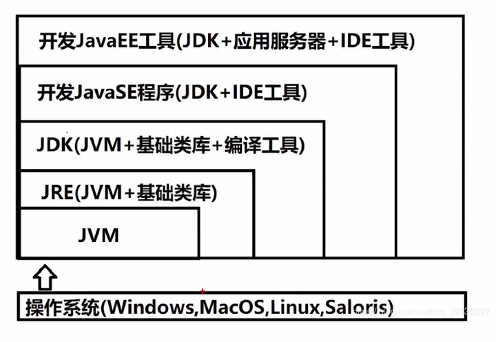
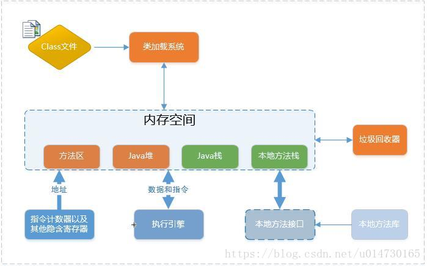
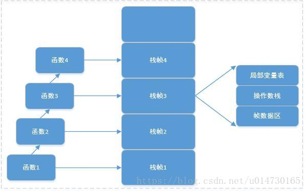

### 集合

    List中存储的数据是顺序的，并且值允许重复;
    Map中存储的数据是无序的，它的键是不允许重复的，但是值是允许重复的;
    Set中存储的数据是无顺序的，并且不允许重复，但元素在集合中的位置是由元素的hashcode决定，即 位置是固定的(Set集合是根据hashcode来进行数据存储 的，所以位置是固定的，但是这个位置不是用户可以控制的，所以对于用户来说set中的元素还是无序的)

#### 对比

    1、ArrayList : 数组列表
    ，内部是通过Array实现，对数据列表进行插入、删除操作时都需要对数组进行拷贝并重排序，因此在知道存储数据量时，尽量初始化初始容量，提升性能 。
    ArrayList extends AbstractList<E>implements List<E>, RandomAccess, Cloneable, java.io.Serializable
    线程不安全，不同步，
    
    2、LinkedList : 双向链表 每个元素都有指向前后元素的指针，顺序读取的效率较高，随机读取的效率较低
    3、Vector : 向量 ， 线程安全的列表，与ArrayList 一样也是通过数组实现的
    4、Stack : 栈 ， 后进先出 LIFO ， 继承自Vector，也是用数组，线程安全的栈

    ArrayList是基于数组的数据结构，LinkedList是基于链 表的数据结构。
    ArrayList适用于查询操作，LinkedList适用于插入和删 除操作。

### 泛型

    Java中的泛型，只在编译阶段有效。在编译过程中，正确检验泛型结果后，会将泛型的相关信息擦出，并且在对象进入和离开方法的边界处添加类型检查和类型转换的方法。
    也就是说，泛型信息不会进入到运行时阶段。

### 序列化

    Serializable 使用 I/O 读写存储在硬盘上，而 Parcelable 是直接 在内存中读写。

### 线程

#### 创建方式

    1.继承Thread
    2.实现Runnable
    3.实现Callable
    对Runnable的异步封装，call方法能拿到返回值 
    使用：MyCallback myCallback = new MyCallback()
        FutureTask<Integer >futureTask = new FutureTask<>(myCallable);
        new Thread(futureTask);
        futureTask.get()

#### wait和sleep

    Wait是 Object 的方法， 只能在同步方法同步块使用
    让当前线程先退出锁 让他其他等待锁的资源进行，只有调用 notify 才可以解除 wait状态，可以竞争资源锁（notify 只是叫醒，让重新参与线程的调度并不会给他安排任务）

    Sleep 是线程类 Thread 的方法，Sleep 在任何时候都可以用
    调用 sleep 方法，不会释放对象锁，正在执行的线程主动让出 CPU（CPU 执行其他任务）sleep 指定时间后 CPU 再回到该线程继续执行

#### 线程多次调用start()

    报IllegalThreadStateException
    start方法会先判断当前线程状态，如果是第一次调用，则会调用一个start0方法，是一个由native修饰的方法，底层有对应c语言写的API，调用会使操作系统状态转换为内核态，
    我们知道，只有内核态才能创建线程，所以调用start0会创建出一个线程。如果是第二次调用，在第一步判断时就会抛出一个异常，所以不能同时调用两次start方法。
    start()方法包含了创建新线程的特殊代码逻辑。而run()方法一般是我们自己写的代码逻辑,run方法可以多次调用

### 线程池

    提高相应速度
    降低资源消耗
    提高线程可管理性

#### 线程池创建

    线程池刚创建时，里面没有一个线程，当调用 execute(Runnable) 方法添加一个任务时
    如果正在运行的线程数量<corePoolSize，则马上创建新核心线程并运行这个任务。
    如果 currentSize >=corePoolSize&&workQueue（等待队列）未满；将新任务安排到 workQueue 中等待执行；
                                  &&workQueue 已满；currentSize<最大线程让数，开启一个新的非核心线程执行任务
    当 currentSize>= corePoolSize&&workQueue 已满&&currentSize>最大线程数,调用 RejectExecutionHandler(拒绝策略)抛出 RejectExecutionExpection 异常；

    线程池的参数：
    corePoolSize,核心线程数
    maximumPoolSize 线程池最大线程数
    KeepAliveTime 空闲线程存活时间
    Timeunit 空闲线程存活时间的单位
    workQueue 工作队列
    ThreadFactory 线程工厂，设定线程名
    Handler 拒绝策略
    CallerRunsPolicy：在调用者线程中直接执行被拒绝任务的 run 方法，除非线程池已经 shutdown，则直接抛弃任务
    AbortPolicy：直接丢弃任务，抛 RejectedExecutionException 异常
    DiscardPolicy：直接丢弃任务什么也不做
    DiscardOldestPolicy

    new ThreadPoolExecutor()

原子性是指一个操作（或一组操作）不可被中断地执行完毕或不执行

# java内存模型

在jvm1.8之前，jvm的逻辑结构和物理结构是对应的。即Jvm在初始化的时候，会为堆（heap），栈（stack），元数据区（matespace）分配指定的内存大小，Jvm线程启动的时候会向服务器申请指定的内存地址空间进行分配。         
在jdk1.8之后，使用了G1垃圾回收器，逻辑上依然存在堆，栈，元数据区。但是在物理结构上，G1采用了分区(Region)的思路，将整个堆空间分成若干个大小相等的内存区域，每次分配对象空间将逐段地使用内存。         
因此，在堆的使用上，G1并不要求对象的存储一定是物理上连续的，只要逻辑上连续即可；每个分区也不会确定地为某个代服务，可以按需在年轻代和老年代之间切换。启动时可以通过参数-XX:G1HeapRegionSize=n可指定分区大小(1MB~32MB，且必须是2的幂)，默认将整堆划分为2048个分区。

1.1 程序计数器
录下一条Jvm指令的执行地址。通过改变程序计数器的值来执行下一条指令

1.2、 Jvm堆
Java堆是和Java应用程序最密切的内存空间，几乎所有的对象都放到堆中。并且堆完全由Jvm管理，通过垃圾回收机制，垃圾对象会被自动清理，而不需显式的释放。
根据垃圾回收机制的不同，Java堆通常被分为以下的集中不同的结构。          
           
New Generation :由 Eden + Survivor （From Space + To Space）组成            

Eden:所以的new出来的新对象都存放到Eden区          
Survivor Space:Eden每次垃圾清理过后，任然没又被清理的对象，会转移到交换区中          
Old Generation :在交换区中未被清理的对象（默认清理18次标记），将转移到老年代。                

1.3、 Jvm栈          
Java栈是一块线程私有的内存空间，Java栈和线程执行密切相关。线程的执行基本单位就是函数调用，每次函数调用的数据就会通过Java栈传递。       
Java栈与数据结构上的栈有着类似的含义，它是一块先进后出的数据结构，只支持出栈和入栈的两种操作。在Java栈中保存的主要内容为栈帧。每次调用一个函数，都会有一个对应的栈帧被压入Java栈。每一个函数调用结束，都会有一个栈帧被弹出Java栈。例如：             

如图所示，每次调用一个函数都会被当做栈帧压入到栈中。其中每一个栈帧对应一个函数。由于每次调用函数都会生成一个栈帧，从而占用一定的栈空间。如果线程中存在大量的递归操作，会频繁的压栈，导致栈的深入过于深入，当栈的空间被消耗殆尽的时候，会抛出StackOverflowError栈溢出错误。              
当函数执行结束返回时，栈帧从Java栈中被弹出。Java方法有两种返回的方式，一种是正常函数返回，即使用return； 另外一种是抛出异常。不管哪种方式，都会导致栈帧被弹出。        

1.3.1、 局部变量表              
局部变量表示栈帧的重要组成部分之一。它用于保存函数已经局部变量。局部变量表中的变量只有在当前的函数中调用有效，当调用函数结束以后，随着函数栈帧的销毁，局部变量表也随之销毁。           

1.3.2、 操作数栈          
操作数栈也是栈帧中重要的内容之一，它主要保存计算过程中的结果，同时作为计算过程临时变量的存储空间。       
操作数栈也是一个先进后出的数据结构，只支持入栈和出栈的两种操作，Java的很多字节码指令都是通过操作数栈进行参数传递的。比如iadd指令，它就会在操作数栈中弹出两个整数进行加法计算，计算结果会被入栈。入下图所示：        
  

1.3.3、 帧数据区          
每个栈帧都包含一个指向运行时常量池中该栈帧所属性方法的引用，持有这个引用是为了支持方法调用过程中的动态连接。在Class文件的常量池中存有大量的符号引用，字节码中的方法调用指令就以常量池中指向方法的符号引用为参数。这些符号引用一部分会在类加载阶段或第一次使用的时候转化为直接引用，这种转化称为静态解析。另外一部分将在每一次的运行期期间转化为直接引用，这部分称为动态连接           

1.4、 Jvm方法区（jdk1.8元数据区）           
它主要存放一些虚拟机加载的类信息，常量，静态变量，即使编译器后的代码等数据。根据Java虚拟机规范的规定，当方法区无法满足内存分配需求时，将抛出OutOfMemoryError异常。       

1.4.1、 运行时常量池        
运行时常量区是方法区的一部分。用于存放编译期生成的各种字面量和符号引用，这部分内容将在类加载后进入方法区的运行时常量池中存放。还会有一些符号引用转换的直接引用一保存在运行时常量池中。        
运行时常量池具备动态性，也就是运行期间也可以将新的常量放入池中，例如String.intern()方法。当常量池无法再申请到内存时，会抛出OutOfMemoryError异常        

1.5 本地方法栈
native 方法调用的过程在本地方法栈中进行

图片展示：
glide:
with（context）:绑定生命周期，
在⼦线程中加载图片
或者 with 传的是 application 类型，则 glide 的生命周期与 app 生命周期绑定；

load：输入图片资源来源
into

飞行app
4.16版本就是调用jni接口，将返回的数据，构造成kml格式航线文件存储，
构造成大疆AIRLine结构，传给sdk，通过返回来的状态去控制飞行

5.54.16版本就是调用jni接口，将返回的数据，构造成kmZ格式航线文件存储，并将文件发送给sdk
接受状态控制飞机飞行;
旧版本的迭代，
我这边负责的就是 psdk osdk ,开发联调，自定义View展示数据

写文件
新版本是我这边测试开发完成的。

jetpack
room viewmodel
lifecycle livedata

Fragment从创建到销毁整个生命周期中涉及到的方法依次为
：onAttach()→onCreate()→onCreateView()→onActivityCreated()→onStart()→onResume()
→onPause()→onStop()→onDestroyView()→onDestroy()→onDetach()，
其中和Activity有不少名称相同作用相似的方法，而不同的方法 有:
onAttach()：当Fragment和Activity建立关联时调用；
onCreateView()：当fragment创建视图调用，在onCreate之后；
onActivityCreated()：当与Fragment相关联的Activity完成onCreate()之后调用；
onDestroyView()：在Fragment中的布局被移除时调用；
onDetach()：当Fragment和Activity解除关联时调用；

不同点：
Fragment相比较于Activity多出4个回调周期，在控制操作上更灵活；
Fragment可以在XML文件中直接进行写入，也可以在Activity中动态添加；
Fragment可以使用show()/hide()或者replace()
随时对Fragment进行切换，并且切换的时候不会出现明显的效果，用户体验会好；Activity虽然也可以进行切换，但是Activity之间切换会有明显的翻页或者其他的效果，在小部分内容的切换上给用户的感觉不是很好；

add不会重新初始化fragment，replace每次都会。所以如果在fragment生命周期内获取数据,使用replace会重复获取；
添加相同的fragment时，replace不会有任何变化，add会报IllegalStateException异常；
replace先remove掉相同id的所有fragment，然后在add当前的这个fragment，而add是覆盖前一个fragment。所以如果使用add一般会伴随hide()
和show()，避免布局重叠；
使用add，如果应用放在后台，或以其他方式被系统销毁，再打开时，hide()中引用的fragment会销
毁，所以依然会出现布局重叠bug，可以使用replace或使用add时，添加一个tag参数；

add不会重新初始化fragment，replace每次都会。所以如果在fragment生命周期内获取获取数据,使用replace会重复获取；
添加相同的fragment时，replace不会有任何变化，add会报IllegalStateException异常；
replace先remove掉相同id的所有fragment，然后在add当前的这个fragment，而add是覆盖前一个fragment。所以如果使用add一般会伴随hide()
和show()，避免布局重叠；
使用add，如果应用放在后台，或以其他方式被系统销毁，再打开时，hide()中引用的fragment会销
毁，所以依然会出现布局重叠bug，可以使用replace或使用add时，添加一个tag参数；

5、FragmentPagerAdapter与FragmentStatePagerAdapter的区别与使用场景
相同点 ：二者都继承PagerAdapter
不同点 ：FragmentPagerAdapter的每个Fragment会持久的保存在FragmentManager中，只要用户可以返回到页面中，它都不会被销毁。
因此适用于那些数据相对静态的页，Fragment数量也比较少的那种；
FragmentStatePagerAdapter只保留当前页面，当页面不可见时，该Fragment就会被消除，释放其资源。因此适用于那些数据动态性较大、占用内存较多，多Fragment的情况；

