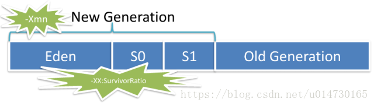
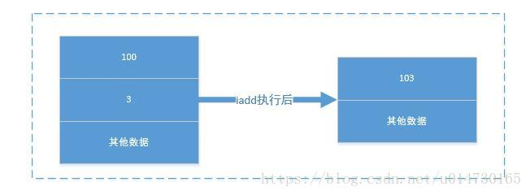

# 集合

    List中存储的数据是顺序的，并且值允许重复;
    Map中存储的数据是无序的，它的键是不允许重复的，但是值是允许重复的;
    Set中存储的数据是无顺序的，并且不允许重复，但元素在集合中的位置是由元素的hashcode决定，即 位置是固定的(Set集合是根据hashcode来进行数据存储 的，所以位置是固定的，但是这个位置不是用户可以控制的，所以对于用户来说set中的元素还是无序的)

## 对比

    1、ArrayList : 数组列表
    ，内部是通过Array实现，对数据列表进行插入、删除操作时都需要对数组进行拷贝并重排序，因此在知道存储数据量时，尽量初始化初始容量，提升性能 。
    ArrayList extends AbstractList<E>implements List<E>, RandomAccess, Cloneable, java.io.Serializable
    线程不安全，不同步，
    
    2、LinkedList : 双向链表 每个元素都有指向前后元素的指针，顺序读取的效率较高，随机读取的效率较低
    3、Vector : 向量 ， 线程安全的列表，与ArrayList 一样也是通过数组实现的
    4、Stack : 栈 ， 后进先出 LIFO ， 继承自Vector，也是用数组，线程安全的栈

    ArrayList是基于数组的数据结构，LinkedList是基于链 表的数据结构。
    ArrayList适用于查询操作，LinkedList适用于插入和删 除操作。

# 泛型

    Java中的泛型，只在编译阶段有效。在编译过程中，正确检验泛型结果后，会将泛型的相关信息擦出，并且在对象进入和离开方法的边界处添加类型检查和类型转换的方法。
    也就是说，泛型信息不会进入到运行时阶段。

# 序列化

    Serializable 使用 I/O 读写存储在硬盘上，而 Parcelable 是直接 在内存中读写。

# 线程

## 什么是线程？

线程是计算机中执行程序的最小单位。它是进程中的一个实体，每个线程都有自己的执行序列、栈和局部变量，但其与其他线程共享进程的资源。

## 为什么要使用线程？

使用线程可以实现同时执行多个任务，提高程序的并发性和响应性。特别是在Android开发中，使用线程可以避免主线程被阻塞，从而保证UI的流畅性。

## 线程状态,六种

1. 初始(NEW)：新创建了一个线程对象，但还没有调用start()方法。
2. 运行(RUNNABLE)
   ：Java线程中将就绪（ready）和运行中（running）两种状态笼统的称为“运行”。线程对象创建后，其他线程(
   比如main线程）调用了该对象的start()
   方法。该状态的线程位于可运行线程池中，等待被线程调度选中，获取CPU的使用权，此时处于就绪状态（ready）。就绪状态的线程在获得CPU时间片后变为运行中状态（running）。
3. 阻塞(BLOCKED)：表示线程阻塞于锁。
4. 等待(WAITING)：进入该状态的线程需要等待其他线程做出一些特定动作（通知或中断）。
5. 超时等待(TIMED_WAITING)：该状态不同于WAITING，它可以在指定的时间后自行返回。
6. 终止(TERMINATED)：表示该线程已经执行完毕。

## 创建方式

1.继承Thread && 匿名内部类

      public class PrintOddEvenRunnable {
          public static void main(String[] args) {
        
              MyThread myThread = new MyThread();
              myThread.start();

          }
      }

      class MyThread extends Thread{
         @Override
         public void run() {
            super.run();
         }
      }

2.实现Runnable

       public class PrintOddEvenRunnable {
          public static void main(String[] args) {
        
              Thread thread = new Thread(new MyRunnable，“runable方式”);  
              thread.start();
               
               //匿名内部类
              Thread thread1 = new Thread(new Runable(){
                   @Override
                     public void run() {
                        super.run();
                     }
               });
               thread1.start();
          }
      }
      
      public MyRunnable implements Runnable{
         @Override
         public void run() {
            super.run();
         }
      }

3.实现Callable
对Runnable的异步封装，call方法能拿到返回值

      public class DemoCallable implements Callable<String>{
          @Override
          public String call() throws Exception {
              // TODO Auto-generated method stub
              return null;
          }
      
          public static void main(String[] args) throws Exception {
              DemoCallable callable = new DemoCallable();
              FutureTask<String> futureTask = new FutureTask<>(callable);
              Thread thread = new Thread(futureTask);
              thread.start();
              ...
              String result = future.get(); //同步获取返回结果

          }
      }

## Thread静态方法

1. Thread.sleep(misseconeds) 不会释放锁资源
   睡眠：当前线程暂停一段时间让给别的线程去运行。Sleep复活时间，根据你传入的睡眠时间而定，等到睡眠到规定的时间后，线程自动复活，它不会释放锁资源。
2. Thread.yield（）
   让当前正在执行线程停下来一下，把执行机会让给别的在等待的线程，自己回到等待的就绪队列里面，自己也有可能会运行到，
   但更大的机会是让别的等待线程运行，相当于将自己的优先级暂时降低一下，把机会让给别人一会儿。

## Thread实例方法

1. Wait是 Object 的方法， 只能在同步方法同步块使用； 当前线程先退出锁 让他其他等待锁的资源进行，
   只有调用 notify 才可以解除 wait状态，可以竞争资源锁（notify 只是叫醒，让重新参与线程的调度并不会给他安排任务）
   notifyAll(叫醒所有)

2. join方法
   join方法，意思就是在自己当前线程加入你调用的线程，本线程则等待，当调用Joni的线程运行完了后，自己再去运行，
   t1和t2两个线程，如果在t1线程里面调用了t2.join()，则t1线程会进行等待状态，t2运行结束以后，才会继续运行t1。这样可以保证线程的先后顺序。

3. interrupt方法 停止线程

         Thread thread = new Thread(() -> {
            while (!Thread.currentThread().isInterrupted()) {
            // 线程执行的代码
            }
         });
      
         thread.start();
         
         // 终止线程
         thread.interrupt();

也可以使用flag停止线程

      public class MyThread implements Runnable {
          private volatile boolean flag = true;
      
          @Override
          public void run() {
              while (flag) {
                  // 线程执行的代码
                  
                  // 检查标志位，决定是否终止线程
                  if (!flag) {
                      return; // 终止线程
                  }
              }
          }
      
          public void stopThread() {
              flag = false;  // 将标志位设置为false
          }
      }

stop()，调用stop方法无论run()中的逻辑是否执行完，都会释放CPU资源，释放锁资源。这会导致线程不安全。
比如：线程A的逻辑是转账（获得锁，1号账户减少100元，2号账户增加100元，释放锁），那线程A刚执行到1号账户减少100元就被调用了stop方法，释放了锁资源，释放了CPU资源。1号账户平白无故少了100元。一场撕逼大战开始了。

## 线程多次调用start()，报IllegalThreadStateException

start方法会先判断当前线程状态，如果是第一次调用，则会调用一个start0方法，是一个由native修饰的方法，底层有对应c语言写的API，调用会使操作系统状态转换为内核态，只有内核态才能创建线程，所以调用start0会创建出一个线程。
如果是第二次调用，在第一步判断时就会抛出一个异常，所以不能同时调用两次start方法。

start()方法包含了创建新线程的特殊代码逻辑。而run()方法一般是我们自己写的代码逻辑,run方法可以多次调用

## 终止线程

suspend和stop弃用原因：
1.suspend()，在调用该方法暂停线程的时候，线程由running状态变成blocked，需要等待resume方法将其重新变成runnable。
而线程由running状态变成blocked时，只释放了CPU资源，没有释放锁资源，可能出现死锁。
比如：线程A拿着锁1被suspend了进入了blocked状态，等待线程B调用resume将线程A重新runnable。但是线程B一直在lock
pool中等待锁1,线程B要拿到锁1才能running去执行resumeA。这就死锁了。

2.stop()，调用stop方法无论run()中的逻辑是否执行完，都会释放CPU资源，释放锁资源。这会导致线程不安全。
比如：线程A的逻辑是转账（获得锁，1号账户减少100元，2号账户增加100元，释放锁），那线程A刚执行到1号账户减少100元就被调用了stop方法，释放了锁资源，释放了CPU资源。1号账户平白无故少了100元。一场撕逼大战开始了。

thread.join()
在很多情况下，主线程创建并启动子线程，如果子线程中要进行大量的耗时运算，主线程将可能早于子线程结束。如果主线程需要知道子线程的执行结果时，就需要等待子线程执行结束了。主线程可以sleep(
xx),但这样的xx时间不好确定，因为子线程的执行时间不确定，join()方法比较合适。

Thread.interrupt方法
在线程wait、sleep等时，会抛出interruptedException异常 且 会把中断标记位重新置为false(
方案：可以在catch内在调用intercept()) 处于死锁状态时，不会理会中断

### 线程池

    提高相应速度
    降低资源消耗
    提高线程可管理性

#### 线程池创建

    线程池刚创建时，里面没有一个线程，当调用 execute(Runnable) 方法添加一个任务时
    如果正在运行的线程数量<corePoolSize，则马上创建新核心线程并运行这个任务。
    如果 currentSize >=corePoolSize&&workQueue（等待队列）未满；将新任务安排到 workQueue 中等待执行；
                                  &&workQueue 已满；currentSize<最大线程让数，开启一个新的非核心线程执行任务
    当 currentSize>= corePoolSize&&workQueue 已满&&currentSize>最大线程数,调用 RejectExecutionHandler(拒绝策略)抛出 RejectExecutionExpection 异常；

    线程池的参数：
    corePoolSize,核心线程数
    maximumPoolSize 线程池最大线程数
    KeepAliveTime 空闲线程存活时间
    Timeunit 空闲线程存活时间的单位
    workQueue 工作队列
    ThreadFactory 线程工厂，设定线程名
    Handler 拒绝策略
    CallerRunsPolicy：在调用者线程中直接执行被拒绝任务的 run 方法，除非线程池已经 shutdown，则直接抛弃任务
    AbortPolicy：直接丢弃任务，抛 RejectedExecutionException 异常
    DiscardPolicy：直接丢弃任务什么也不做
    DiscardOldestPolicy

    new ThreadPoolExecutor()

3. 在Android中，如何创建线程？

可以通过继承Thread类或实现Runnable接口来创建线程。通过重写Thread的run方法或Runnable的run方法，可以定义线程的执行逻辑。

4. Android中的主线程是什么？它的重要性是什么？

主线程是Android应用程序默认的UI线程，也被称为主(UI)
线程。它负责处理用户界面的交互和更新，因此对于保持良好的用户体验非常重要。主线程上的代码应尽量避免耗时操作，否则可能导致ANR（Application
Not Responding）错误。

5. 什么是ANR？如何避免ANR？

ANR指的是应用程序无响应，即系统认为应用程序的响应时间过长，可能导致用户体验差。为了避免ANR，在主线程中应尽量避免执行耗时操作，例如网络请求、数据存储等。这些操作应该放在子线程或线程池中执行，确保主(
UI)线程的流畅性。

6. 什么是线程池？

线程池是一种管理和复用线程的机制。它通过预先创建一组线程，并将多个任务分配给这些线程来提高性能和资源利用率。

7. 在Android中如何使用线程池？

可以使用Java提供的Executor和ExecutorService等类来创建和管理线程池。通过创建ThreadPoolExecutor实例，可以设置线程池的参数，如线程数量、线程空闲时间、任务队列等。

8. 线程池有哪几种类型？它们的区别是什么？

Java中常用的线程池类型有FixedThreadPool、CachedThreadPool、SingleThreadExecutor和ScheduledThreadPool。它们的区别在于线程数量的固定性、线程的创建和销毁策略以及任务的执行方式。

9. 如何手动停止一个线程池？

可以通过调用线程池的shutdown()
方法来停止线程池的运行。该方法会等待已经提交的任务执行完成，然后关闭线程池。如果需要立即停止线程池，可以使用shutdownNow()
方法。

10. 什么是线程同步？在Android中如何实现线程同步？

线程同步是多个线程协同工作以实现数据的正确和一致访问的机制。在Android中，可以使用关键字synchronized、ReentrantLock、Condition等来实现线程同步。另外，可以使用synchronized块来特定只对某一段代码进行同步。

11. 如何在子线程中更新UI？

在Android中，只有主线程(UI线程)可以更新UI。可以通过Handler、runOnUiThread()、View.post()
等方式在子线程中更新UI。这些方法实际上是将UI更新操作放到主线程的消息队列中，在下一个合适的时机执行。

12. 什么是Handler？如何使用Handler来更新UI？

Handler是Android用于跨线程通信的机制。通过Handler，可以将消息和Runnable对象发送到与之关联的线程的消息队列中。在主线程中创建Handler对象，并在子线程中发送消息到主线程中处理，以实现在子线程中更新UI。

13. 什么是AsyncTask？它的使用场景是什么？

AsyncTask是Android提供的一个方便的类，用于在后台线程执行耗时操作，并在主线程更新UI。常见的使用场景包括网络请求、数据库查询、文件读写等需要异步执行的任务。

14. 如何取消一个正在执行的AsyncTask？

可以调用AsyncTask的cancel()方法来取消正在执行的任务。在AsyncTask中需要通过判断isCancelled()
方法来检查任务是否被取消，并及时退出任务执行逻辑。

15. 什么是Loader？为什么要使用Loader？

Loader是Android提供的一种异步数据加载机制，用于在Activity或Fragment中加载数据。Loader会自动处理异步加载和屏幕旋转等情况下的数据恢复，使数据加载更加高效和稳定。

16. 什么是RxJava和RxAndroid？它们的优势是什么？

RxJava是一个基于观察者模式和函数式编程思想的库，用于简化异步操作和事件驱动程序设计。RxAndroid是RxJava在Android平台上的扩展库。它们的优势在于提供了丰富的操作符和线程控制，使得异步操作更加容易和优雅。

17. 什么是Coroutine？它在Android中的使用场景是什么？

Coroutine是Kotlin提供的一种协程机制，用于简化异步编程。它通过类似于线程的概念，但没有线程的开销，实现了轻量级的并发操作。在Android中，Coroutine可以用于网络请求、数据库操作等异步任务的执行。

18. 什么是线程安全？如何保证线程安全？

线程安全是指在多线程环境下，共享资源能够被正确和一致地访问。要保证线程安全，可以使用关键字synchronized、volatile、Atomic类和Concurrent类等机制。另外，还可以使用锁机制来保护临界区，避免多线程同时访问导致数据不一致。

19. 在多线程环境中，什么是死锁？如何避免死锁？

死锁是指多个线程因为相互等待对方所持有的资源而无法继续运行的状态。为避免死锁，可以采取一些措施，如避免使用嵌套锁、按照相同的顺序获取多个锁、使用超时机制等。

20. 在多线程环境中，什么是线程间通信？如何实现线程间通信？

线程间通信是指不同线程之间传递数据或消息的机制。在Java中，可以使用wait()、notify()和notifyAll()
方法来实现线程间的等待和唤醒。另外，还可以使用阻塞队列(BlockingQueue)等数据结构来实现线程间的数据传递和同步。

原子性是指一个操作（或一组操作）不可被中断地执行完毕或不执行

# java内存模型

               
在jvm1.8之前，jvm的逻辑结构和物理结构是对应的。即Jvm在初始化的时候，会为堆（heap），栈（stack），元数据区（matespace）分配指定的内存大小，Jvm线程启动的时候会向服务器申请指定的内存地址空间进行分配。         
在jdk1.8之后，使用了G1垃圾回收器，逻辑上依然存在堆，栈，元数据区。但是在物理结构上，G1采用了分区(Region)
的思路，将整个堆空间分成若干个大小相等的内存区域，每次分配对象空间将逐段地使用内存。         
因此，在堆的使用上，G1并不要求对象的存储一定是物理上连续的，只要逻辑上连续即可；每个分区也不会确定地为某个代服务，可以按需在年轻代和老年代之间切换。启动时可以通过参数-XX:
G1HeapRegionSize=n可指定分区大小(1MB~32MB，且必须是2的幂)，默认将整堆划分为2048个分区。

1.1 程序计数器
录下一条Jvm指令的执行地址。通过改变程序计数器的值来执行下一条指令

1.2、 Jvm堆
Java堆是和Java应用程序最密切的内存空间，几乎所有的对象都放到堆中。并且堆完全由Jvm管理，通过垃圾回收机制，垃圾对象会被自动清理，而不需显式的释放。
根据垃圾回收机制的不同，Java堆通常被分为以下的集中不同的结构。          
           
New Generation :由 Eden + Survivor （From Space + To Space）组成

Eden:所以的new出来的新对象都存放到Eden区          
Survivor Space:Eden每次垃圾清理过后，任然没又被清理的对象，会转移到交换区中          
Old Generation :在交换区中未被清理的对象（默认清理18次标记），将转移到老年代。

1.3、 Jvm栈          
Java栈是一块线程私有的内存空间，Java栈和线程执行密切相关。线程的执行基本单位就是函数调用，每次函数调用的数据就会通过Java栈传递。       
Java栈与数据结构上的栈有着类似的含义，它是一块先进后出的数据结构，只支持出栈和入栈的两种操作。在Java栈中保存的主要内容为栈帧。每次调用一个函数，都会有一个对应的栈帧被压入Java栈。每一个函数调用结束，都会有一个栈帧被弹出Java栈。例如：             

如图所示，每次调用一个函数都会被当做栈帧压入到栈中。其中每一个栈帧对应一个函数。由于每次调用函数都会生成一个栈帧，从而占用一定的栈空间。如果线程中存在大量的递归操作，会频繁的压栈，导致栈的深入过于深入，当栈的空间被消耗殆尽的时候，会抛出StackOverflowError栈溢出错误。              
当函数执行结束返回时，栈帧从Java栈中被弹出。Java方法有两种返回的方式，一种是正常函数返回，即使用return；
另外一种是抛出异常。不管哪种方式，都会导致栈帧被弹出。

1.3.1、 局部变量表              
局部变量表示栈帧的重要组成部分之一。它用于保存函数已经局部变量。局部变量表中的变量只有在当前的函数中调用有效，当调用函数结束以后，随着函数栈帧的销毁，局部变量表也随之销毁。

1.3.2、 操作数栈          
操作数栈也是栈帧中重要的内容之一，它主要保存计算过程中的结果，同时作为计算过程临时变量的存储空间。       
操作数栈也是一个先进后出的数据结构，只支持入栈和出栈的两种操作，Java的很多字节码指令都是通过操作数栈进行参数传递的。比如iadd指令，它就会在操作数栈中弹出两个整数进行加法计算，计算结果会被入栈。入下图所示：        

1.3.3、 帧数据区          
每个栈帧都包含一个指向运行时常量池中该栈帧所属性方法的引用，持有这个引用是为了支持方法调用过程中的动态连接。在Class文件的常量池中存有大量的符号引用，字节码中的方法调用指令就以常量池中指向方法的符号引用为参数。这些符号引用一部分会在类加载阶段或第一次使用的时候转化为直接引用，这种转化称为静态解析。另外一部分将在每一次的运行期期间转化为直接引用，这部分称为动态连接

1.4、 Jvm方法区（jdk1.8元数据区）           
它主要存放一些虚拟机加载的类信息，常量，静态变量，即使编译器后的代码等数据。根据Java虚拟机规范的规定，当方法区无法满足内存分配需求时，将抛出OutOfMemoryError异常。

1.4.1、 运行时常量池        
运行时常量区是方法区的一部分。用于存放编译期生成的各种字面量和符号引用，这部分内容将在类加载后进入方法区的运行时常量池中存放。还会有一些符号引用转换的直接引用一保存在运行时常量池中。        
运行时常量池具备动态性，也就是运行期间也可以将新的常量放入池中，例如String.intern()
方法。当常量池无法再申请到内存时，会抛出OutOfMemoryError异常

1.5 本地方法栈
native 方法调用的过程在本地方法栈中进行

# 数据库常用语句

1. SELECT：从数据库中检索数据。
    - 例如：`SELECT * FROM customers;` 表示从名为"customers"的表中选择所有列的数据。

2. INSERT INTO：将新数据插入到数据库表中。
    - 例如：`INSERT INTO customers (name, email) VALUES ('John Doe', 'john@example.com');`
      表示将一条新的客户记录插入到"customers"表中。

3. UPDATE：更新表中的数据。
    - 例如：`UPDATE customers SET name = 'Jane Doe' WHERE id = 1;` 表示将ID为1的客户的名称更新为"Jane
      Doe"。

4. DELETE FROM：从表中删除数据。
    - 例如：`DELETE FROM customers WHERE id = 1;` 表示从"customers"表中删除ID为1的客户记录。

5. CREATE TABLE：创建一个新的数据库表。
    - 例如：`CREATE TABLE students (id INT, name VARCHAR(50), age INT);` 表示创建一个名为"students"
      的新表，包含id、name和age列。

6. ALTER TABLE：修改数据库表的结构，如添加新列、修改列的数据类型等。
    - 例如：`ALTER TABLE students ADD gender VARCHAR(10);` 表示向"students"表中添加一个名为"gender"
      的新列。

7. DROP TABLE：删除数据库表。
    - 例如：`DROP TABLE customers;` 表示删除名为"customers"的表。

图片展示：
glide:
with（context）:绑定生命周期，
在⼦线程中加载图片
或者 with 传的是 application 类型，则 glide 的生命周期与 app 生命周期绑定；

load：输入图片资源来源
into

飞行app
4.16版本就是调用jni接口，将返回的数据，构造成kml格式航线文件存储，
构造成大疆AIRLine结构，传给sdk，通过返回来的状态去控制飞行

5.54.16版本就是调用jni接口，将返回的数据，构造成kmZ格式航线文件存储，并将文件发送给sdk
接受状态控制飞机飞行;
旧版本的迭代，
我这边负责的就是 psdk osdk ,开发联调，自定义View展示数据

写文件
新版本是我这边测试开发完成的。

jetpack
room viewmodel
lifecycle livedata

Fragment从创建到销毁整个生命周期中涉及到的方法依次为
：onAttach()→onCreate()→onCreateView()→onActivityCreated()→onStart()→onResume()
→onPause()→onStop()→onDestroyView()→onDestroy()→onDetach()，
其中和Activity有不少名称相同作用相似的方法，而不同的方法 有:
onAttach()：当Fragment和Activity建立关联时调用；
onCreateView()：当fragment创建视图调用，在onCreate之后；
onActivityCreated()：当与Fragment相关联的Activity完成onCreate()之后调用；
onDestroyView()：在Fragment中的布局被移除时调用；
onDetach()：当Fragment和Activity解除关联时调用；

不同点：
Fragment相比较于Activity多出4个回调周期，在控制操作上更灵活；
Fragment可以在XML文件中直接进行写入，也可以在Activity中动态添加；
Fragment可以使用show()/hide()或者replace()
随时对Fragment进行切换，并且切换的时候不会出现明显的效果，用户体验会好；Activity虽然也可以进行切换，但是Activity之间切换会有明显的翻页或者其他的效果，在小部分内容的切换上给用户的感觉不是很好；

add不会重新初始化fragment，replace每次都会。所以如果在fragment生命周期内获取数据,使用replace会重复获取；
添加相同的fragment时，replace不会有任何变化，add会报IllegalStateException异常；
replace先remove掉相同id的所有fragment，然后在add当前的这个fragment，而add是覆盖前一个fragment。所以如果使用add一般会伴随hide()
和show()，避免布局重叠；
使用add，如果应用放在后台，或以其他方式被系统销毁，再打开时，hide()中引用的fragment会销
毁，所以依然会出现布局重叠bug，可以使用replace或使用add时，添加一个tag参数；

add不会重新初始化fragment，replace每次都会。所以如果在fragment生命周期内获取获取数据,使用replace会重复获取；
添加相同的fragment时，replace不会有任何变化，add会报IllegalStateException异常；
replace先remove掉相同id的所有fragment，然后在add当前的这个fragment，而add是覆盖前一个fragment。所以如果使用add一般会伴随hide()
和show()，避免布局重叠；
使用add，如果应用放在后台，或以其他方式被系统销毁，再打开时，hide()中引用的fragment会销
毁，所以依然会出现布局重叠bug，可以使用replace或使用add时，添加一个tag参数；

5、FragmentPagerAdapter与FragmentStatePagerAdapter的区别与使用场景
相同点 ：二者都继承PagerAdapter
不同点 ：FragmentPagerAdapter的每个Fragment会持久的保存在FragmentManager中，只要用户可以返回到页面中，它都不会被销毁。
因此适用于那些数据相对静态的页，Fragment数量也比较少的那种；
FragmentStatePagerAdapter只保留当前页面，当页面不可见时，该Fragment就会被消除，释放其资源。因此适用于那些数据动态性较大、占用内存较多，多Fragment的情况；

