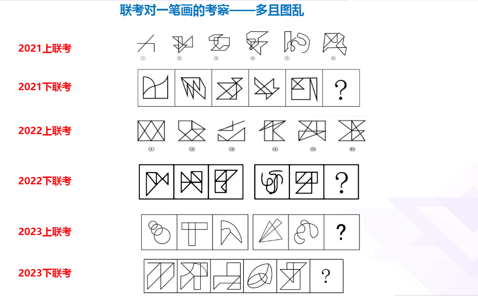

常识判断 20题 20分

言语理解 20题 40分
言语理解：片段阅读： 04题 08分
言语理解：语句表达： 06题 12分
言语理解：逻辑填空： 10题 20分

判断推理 35题 45分
判断推理：图形推理:  05题 05分
判断推理：定义判断:  10题 10分
判断推理：类比判断:  10题 10分
判断推理：逻辑判断:  10题 20分

数学运算 15题 27分
数量分析：数学运算： 05题 09分
数量分析：资料分析： 10题 18分

综合分析：10题 18分
综合分析：策略制定： 05题 09分
综合分析：实验设计： 05题 09分

# 图形推理：
## 小球
1. 数量是否整齐，整齐内圈外圈找规律，横行数列找规律

2. 找对称
3. 数量不均匀，黑白运算
## 图像线条，找奇点，找笔画

# 数学计算

乘法：首乘首，尾乘尾，外乘内乘加和在中间
27*63 = (2*6)(3*7)+(6*7+2*3)=1221 + 48 = 1269

除法：截位直除，判断截几位，差距大截取两位，差距小截取三位

# 资料分析
同比：往前推一年，环比往前推一月

基期量 现期量 计算
基期 = 现期/（1+r）